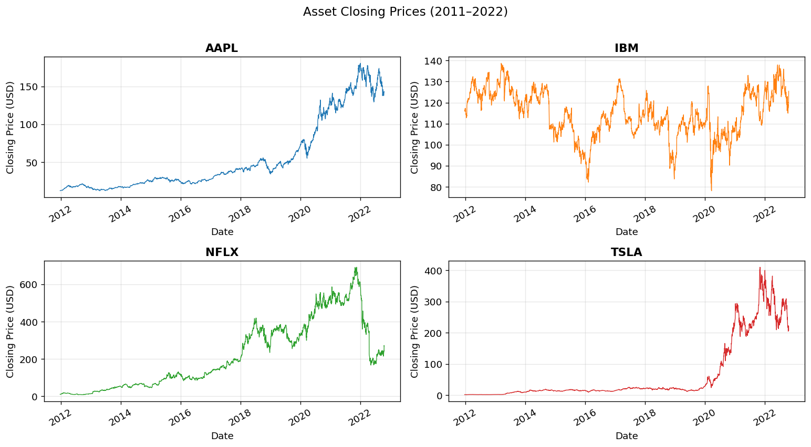
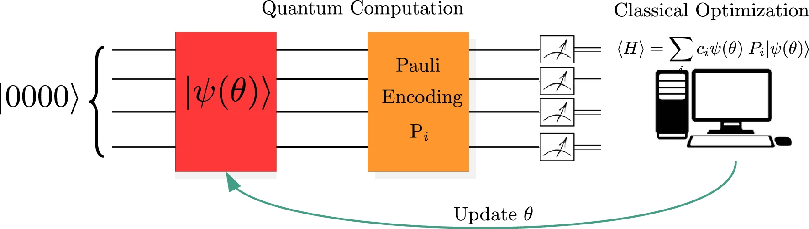
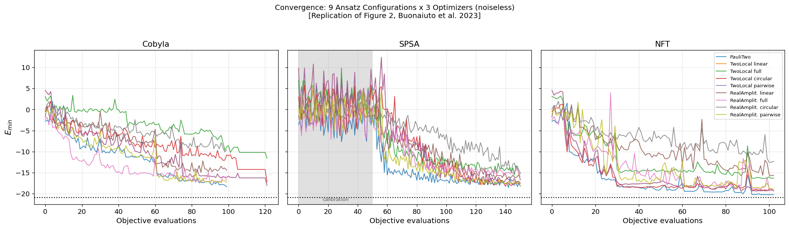
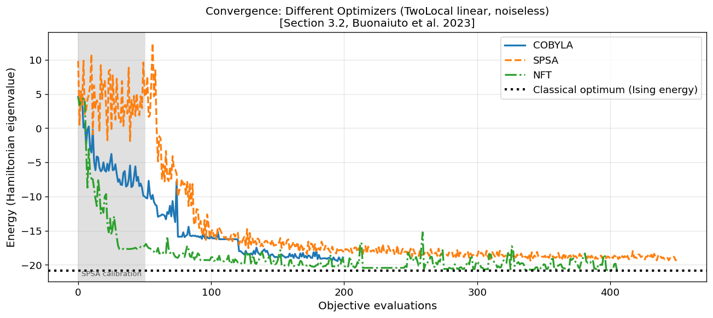
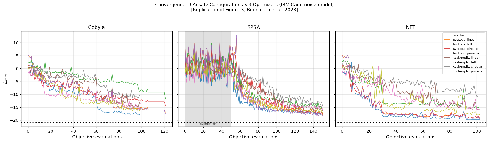
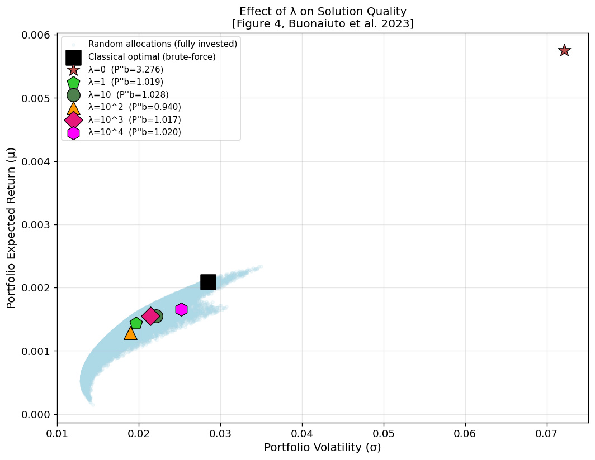
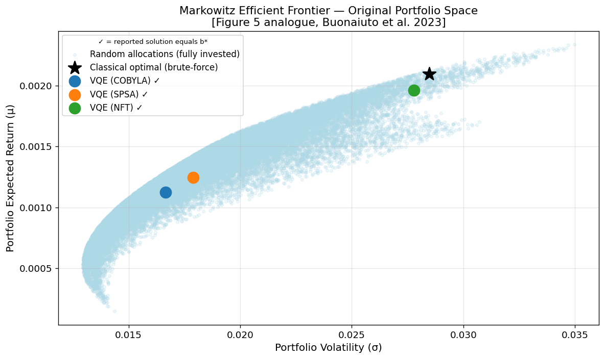

در این پروژه، مقاله Buonaiuto et al. (2023) با عنوان «Best practices for portfolio optimization by quantum computing, experimented on real quantum devices» [#ref-buonaiuto] پیاده‌سازی و بازتولید شده است. مسئله بهینه‌سازی پورتفولیو (Portfolio Optimization) که به‌طور کلاسیک توسط Markowitz فرموله شده، ابتدا به یک مسئله‌ی بهینه‌سازی با متغیرهای صحیح تبدیل، سپس با کدگذاری باینری فشرده به یک Quadratic Unconstrained Binary Optimization (QUBO) نگاشت، و در نهایت به یک هامیلتونی آیزینگ ترجمه شده است. این هامیلتونی با الگوریتم Variational Quantum Eigensolver (VQE) — یک الگوریتم هیبریدی کوانتومی-کلاسیک — روی شبیه‌ساز کوانتومی Qiskit Aer حل شده است. در این گزارش، پیش از ورود به جزئیات پیاده‌سازی، پیش‌زمینه‌ی لازم درباره‌ی محاسبات کوانتومی (کیوبیت، برهم‌نهی، درهم‌تنیدگی، عملگرهای پائولی)، نظریه‌ی بهینه‌سازی ترکیبیاتی (QUBO و مدل آیزینگ)، و اصول VQE به‌طور کامل شرح داده شده تا مبنای نظری هر گام پیاده‌سازی روشن باشد. ۹ پیکربندی ansatz (`TwoLocal` و `RealAmplitudes` با انواع entanglement، به‌علاوه `PauliTwoDesign`) و سه بهینه‌ساز کلاسیک (COBYLA، SPSA، NFT) مقایسه شدند، اثر ضریب جریمه‌ی λ روی کیفیت جواب و برآورده‌شدن قید بودجه بررسی شد، و همگرایی در حضور مدل نویز واقعی IBM Cairo شبیه‌سازی شد. به دلیل عدم دسترسی به سخت‌افزار کوانتومی واقعی، بخش مربوط به اجرا روی دستگاه‌های IBM (شکل‌های ۵ و ۶ مقاله) از پیاده‌سازی حذف شده است. نتایج کیفی — برتری `PauliTwoDesign` و الگوهای درهم‌تنیدگی `linear`/`pairwise` بر `full` و `circular`، رفتار متمایز هر بهینه‌ساز، و اثر λ روی برآورده‌شدن قید بودجه — با یافته‌های مقاله همخوانی دارد؛ در ۲۱ پیکربندی از ۲۷ پیکربندی بدون نویز و ۲۰ از ۲۷ پیکربندی نویزی، جوابی که VQE گزارش می‌کند دقیقا همان بیت‌استرینگ بهینه‌ی کلاسیک است. در مقابل، مقادیر عددی دقیق و مقیاس نمودارهای همگرایی با مقاله یکسان نیستند. نگاشت QUBO→ising این پیاده‌سازی به‌طور مستقل (با اشتقاق نمادین معادلات ۱۳ تا ۱۶ مقاله روی یک نمونه‌ی کوچک، و مقایسه با خروجی مستقیم `to_ising` کتابخانه‌ی Qiskit) تایید شده و منشا خطا نیست؛ در عوض، سه عامل مشخص و قابل‌استناد شناسایی شد: نبودِ نرمال‌سازی با بودجه در ساخت هامیلتونی مقاله — برخلاف معادله‌ی (۷) خودِ آن — که دقیقا ضریب $B^2 = 4\times10^6$ اختلاف مقیاس انرژی شکل ۲ را توضیح می‌دهد؛ تفاوت در قرارداد گزارش مقیاسِ بازده/نوسان در شکل ۴ (سالانه‌سازی در مقاله، در برابر گزارش روزانه‌ی این پیاده‌سازی)؛ و یک ناسازگاری درونی در خودِ مقاله بین تعداد کیوبیت گزارش‌شده (۱۲) و آنچه اعمال دقیق معادلات (۸) و (۹) مقاله روی داده‌ی توصیف‌شده‌ی آن به دست می‌دهد (۱۵) — عددی که تنها با بودجه‌ای حدود نصفِ $B=2000$ اعلام‌شده‌ی مقاله سازگار است. این تفاوت‌ها به‌طور مفصل، همراه با شواهد کمّی و راستی‌آزمایی مستقل، تحلیل و توجیه شده‌اند.

بهینه‌سازی پورتفولیو؛ Variational Quantum Eigensolver؛ QUBO؛ هامیلتونی آیزینگ؛ محاسبات کوانتومی؛ Qiskit

---

# مقدمه

## مسئله بهینه‌سازی پورتفولیو

بهینه‌سازی پورتفولیو (Portfolio Optimization) یک مسئله بنیادین در حوزه‌ی مالی است: با داشتن مجموعه‌ای از دارایی‌ها (سهام) و یک بودجه‌ی مشخص، باید تصمیم گرفت چه مقدار از هر دارایی خریداری شود تا هم‌زمان بازده مورد انتظار حداکثر و ریسک (نوسان) حداقل شود. این دو هدف معمولا در تضاد با یکدیگرند: دارایی‌هایی که به‌طور تاریخی بازده بالاتری داشته‌اند، معمولا نوسان (ریسک) بیشتری هم دارند. بنابراین سرمایه‌گذار باید بین این دو هدف یک trade-off انتخاب کند.

این مسئله اولین‌بار توسط هری مارکوویتز در سال ۱۹۵۲ به‌صورت یک مسئله بهینه‌سازی درجه‌دوم فرموله شد [#ref-markowitz]، کاری که بعدها جایزه‌ی نوبل اقتصاد را برایش به ارمغان آورد و پایه‌ی نظریه‌ی مدرن پورتفولیو (Modern Portfolio Theory) را تشکیل داد. ایده‌ی محوری مارکوویتز این بود که ریسک یک پورتفولیو را نمی‌توان صرفا با جمع ریسک تک‌تک دارایی‌ها محاسبه کرد؛ باید همبستگی (correlation) بین بازده‌ی دارایی‌های مختلف را نیز در نظر گرفت. برای مثال، اگر دو دارایی به‌طور هم‌زمان افت یا رشد کنند (همبستگی مثبت بالا)، نگه‌داشتن هر دو در یک پورتفولیو ریسک را کاهش نمی‌دهد؛ اما اگر رفتار آن‌ها معکوس یکدیگر باشد (همبستگی منفی)، ترکیب آن‌ها می‌تواند نوسان کلی پورتفولیو را کاهش دهد بدون آنکه لزوما بازده مورد انتظار کاهش یابد. این خاصیت را «تنوع‌بخشی» (diversification) می‌نامند و ریاضیات آن دقیقا در ماتریس کوواریانس نهفته است.

اگر متغیرهای تصمیم پیوسته در نظر گرفته شوند (یعنی $x_i$ نشان‌دهنده‌ی کسری از بودجه‌ی کل باشد که در دارایی $i$ سرمایه‌گذاری می‌شود)، مسئله‌ی مارکوویتز به شکل زیر است:

$$
\max_{x} \mathscr{L}(x) = \mu^T x - q\, x^T \Sigma x \quad \text{s.t.} \sum_i x_i = 1
$$

که در آن $\mu$ بردار بازده مورد انتظار هر دارایی، $\Sigma$ ماتریس کوواریانس بازده‌ها، و $q$ ضریب ریسک‌گریزی (risk aversion) است که trade-off بین بازده و ریسک را کنترل می‌کند: $q=0$ یعنی سرمایه‌گذار فقط به حداکثرسازی بازده اهمیت می‌دهد (بدون توجه به ریسک)، در حالی که $q$ بزرگ یعنی اجتناب شدید از ریسک، حتی به قیمت از دست دادن بازده.

مجموعه‌ی همه‌ی جواب‌های بهینه (برای مقادیر مختلف $q$) روی یک منحنی به نام «مرز کارای مارکوویتز» (Markowitz Efficient Frontier) قرار می‌گیرند: برای هر سطح از ریسک، این منحنی بیشینه‌ی بازده‌ی قابل دستیابی را نشان می‌دهد. هر پورتفولیویی که زیر این مرز باشد، غیربهینه است — چون می‌توان با همان ریسک، بازده‌ی بیشتری به‌دست آورد، یا با همان بازده، ریسک کمتری متحمل شد.

برای محاسبه‌ی دقیق $\mu$ و $\Sigma$ از داده‌ی تاریخی، مقاله معادلات آماری استانداردی تعریف می‌کند. بازده‌ی روزانه‌ی هر دارایی بین دو روز متوالی $t-1$ و $t$ به‌صورت
$$
r^t_i = \frac{p^t_i - p^{t-1}_i}{p^{t-1}_i}
$$
تعریف می‌شود. با فرض توزیع نرمال بازده‌ها، بازده‌ی مورد انتظار هر دارایی با میانگین‌گیری روی کل تاریخچه به دست می‌آید:
$$
\mu_i = E[r_i] = \frac{1}{T}\sum_{t=1}^{T} r^t_i
$$
و واریانس هر دارایی و کوواریانس بین هر جفت دارایی به همین ترتیب:
$$
\sigma_i^2 = E[(r_i-\mu_i)^2] = \frac{1}{T-1}\sum_{t=1}^{T}(r^t_i-\mu_i)^2, \qquad
$$
$$
\sigma_{ij} = E[(r_i-\mu_i)(r_j-\mu_j)]
$$
$$
= \frac{1}{T-1}\sum_{t=1}^{T}(r^t_i-\mu_i)(r^t_j-\mu_j)
$$
عناصر قطری ماتریس $\Sigma$ همان $\sigma_i^2$ (ریسک هر دارایی به‌تنهایی) و عناصر غیرقطری همان $\sigma_{ij}$ (co-movement بین دو دارایی) هستند. این دقیقا همان محاسباتی است که در پیاده‌سازی این پروژه، پس از دریافت قیمت‌های تاریخی از `yfinance`، برای ساخت $\mu$ و $\Sigma$ اجرا شده است.

## پیچیدگی محاسباتی مسئله

اگر مسئله با متغیرهای پیوسته حل شود، یک راه‌حل تحلیلی دقیق و کارآمد وجود دارد: چون ماتریس کوواریانس $\Sigma$ نیمه‌معین مثبت (positive semi-definite) است، بهینه‌سازی تابع درجه‌دوم با قید خطی را می‌توان با ضرایب لاگرانژ (در حالت قید تساوی) یا شرایط Karush–Kuhn–Tucker (در حالت قید نامساوی) به یک دستگاه معادلات خطی تبدیل کرد که با تجزیه‌ی کولسکی (Cholesky decomposition) ماتریس کوواریانس متقارن، در پیچیدگی زمانی $O(N^3)$ (که $N$ تعداد دارایی‌هاست) قابل حل دقیق است.

اما به‌محض آنکه متغیرها صحیح یا باینری شوند (که همان‌طور که در بخش قبل دیدیم، برای تطابق با واقعیت خرید سهام ضروری است)، مسئله به بهینه‌سازی ترکیبیاتی تبدیل می‌شود که NP-hard است (و نسخه‌ی تصمیم آن NP-complete). دلیل این جهش شدید در پیچیدگی ساده است: فضای جستجو برای $b$ متغیر باینری برابر $2^b$ حالت، و برای $N$ متغیر صحیح در بازه‌ی $[0, n_{max}]$ برابر $(n_{max}+1)^N$ حالت است — هر دو به‌طور نمایی (نه چندجمله‌ای) با اندازه‌ی مسئله رشد می‌کنند، برخلاف حالت پیوسته که چندجمله‌ای ($O(N^3)$) بود.

از نظر نظریه‌ی پیچیدگی محاسبات کوانتومی، امید به بهبود این وضعیت با کوانتوم از کلاس پیچیدگی BQP (Bounded-error Quantum Polynomial) ناشی می‌شود — معادل کوانتومی کلاس BPP (Bounded-error Probabilistic Polynomial) در محاسبات کلاسیک احتمالاتی. اگرچه تاکنون برای هیچ مسئله‌ی NP، جدایی اثبات‌شده‌ی کوانتومی/کلاسیک وجود ندارد، اما این باور رایج (هرچند غیرقطعی) وجود دارد که BQP زیرمجموعه‌ی سخت‌گیرانه‌ی BPP نیست، یعنی از نظر پیچیدگی زمانی، کامپیوترهای کوانتومی می‌توانند برخی مسائل را کارآمدتر از کامپیوترهای کلاسیک حل کنند. این حدس نظری — نه یک قطعیت اثبات‌شده — انگیزه‌ی اصلی پشت کاربرد الگوریتم‌های کوانتومی برای بهینه‌سازی ترکیبیاتی از جمله بهینه‌سازی پورتفولیو است.

در عمل، روش‌های کلاسیک رایج برای این کلاس مسئله شامل branch-and-bound (یک روش هندسی-جستجویی که فضای جستجو را با هرس شاخه‌های نامعتبر کوچک می‌کند) و روش‌های ابتکاری (heuristic) مانند الگوریتم ژنتیک، ازدحام ذرات، و شبیه‌سازی annealing هستند؛ همگی این‌ها محدودیت‌هایی دارند و در بهترین حالت جواب‌های تقریبی ارائه می‌دهند، و در عمل تنها برای چند صد دارایی روی کامپیوترهای کلاسیک فعلی عملی‌اند. مقاله‌ی اصلی از پیاده‌سازی کتابخانه‌ی CPLEX (یک بسته‌ی تجاری بهینه‌سازی که از رویکرد Lagrangian dual relaxation برای مسائل انتخاب پورتفولیو با ساختار جداپذیر استفاده می‌کند) به‌عنوان معیار مرجع کلاسیک استفاده کرده، که قادر است مسائل پورتفولیو تا ۱۲۰ دارایی را حل کند.

از آنجا که در عمل تنها می‌توان تعداد صحیحی از واحد هر سهم خریداری کرد (نمی‌توان مثلا ۳.۷ سهم اپل خرید)، این فرمول‌بندی پیوسته باید به یک مسئله با متغیرهای صحیح تبدیل شود. این گام — تبدیل مسئله‌ی پیوسته به مسئله‌ی صحیح، و سپس کدگذاری آن به متغیرهای باینری با یک روش فشرده و کارآمد — نکته‌ی اصلی است که مقاله‌ی Buonaiuto et al. را از پیاده‌سازی‌های استاندارد و ساده‌ی موجود در Qiskit Finance متمایز می‌کند و در بخش فرمول‌بندی ریاضی مسئله به‌طور کامل توضیح داده می‌شود.
## چرا محاسبات کوانتومی؟

مسئله‌ی بهینه‌سازی پورتفولیو با متغیرهای صحیح یا باینری، در کلاس مسائل بهینه‌سازی ترکیبیاتی (Combinatorial Optimization) قرار می‌گیرد. این کلاس مسائل، به دلیل ماهیت گسسته‌ی متغیرها، معمولا NP-hard هستند: برای یافتن جواب دقیق، در بدترین حالت باید تمام حالت‌های ممکن (که به‌صورت نمایی با تعداد متغیرها رشد می‌کند) بررسی شوند. برای مثال، اگر مسئله $n$ متغیر باینری داشته باشد، فضای جستجو $2^n$ حالت دارد؛ برای $n=15$ (که در این پروژه استفاده شده) این عدد ۳۲۷۶۸ است — همچنان قابل مدیریت با brute-force روی یک کامپیوتر کلاسیک معمولی — اما برای مسائل واقعی با ده‌ها یا صدها دارایی، این عدد به سرعت از توان محاسباتی هر کامپیوتر کلاسیک فراتر می‌رود.

روش‌های کلاسیک دقیق مانند branch-and-bound سعی می‌کنند با هرس‌کردن هوشمندانه‌ی فضای جستجو (حذف‌کردن شاخه‌هایی که قطعا به جواب بهینه منتهی نمی‌شوند)، این انفجار نمایی را کنترل کنند، اما در بدترین حالت هنوز پیچیدگی نمایی دارند. به همین دلیل، برای مسائل بزرگ‌تر از روش‌های تقریبی (heuristic) مانند الگوریتم ژنتیک، شبیه‌سازی annealing، یا ازدحام ذرات (Particle Swarm) استفاده می‌شود که جواب «خوب» (نه لزوما بهینه‌ی مطلق) را در زمان معقول می‌یابند.

الگوریتم‌های کوانتومی مانند VQE و QAOA (Quantum Approximate Optimization Algorithm) یک مسیر جایگزین ارائه می‌دهند: این‌ها نیز الگوریتم‌های تقریبی هستند (یعنی تضمین نمی‌دهند حتما جواب بهینه‌ی سراسری را می‌یابند)، اما این امکان نظری وجود دارد که با بهره‌گیری از پدیده‌های کوانتومی مانند برهم‌نهی (superposition) و درهم‌تنیدگی (entanglement)، بتوانند فضای جستجو را به شکلی موثرتر از الگوریتم‌های کلاسیک مشابه کاوش کنند. این مسئله دقیقا به همین دلیل به‌عنوان یک مسئله‌ی benchmark رایج برای آزمایش کارایی سخت‌افزار و الگوریتم‌های کوانتومی مطرح مورد استفاده قرار می‌گیرد — نه لزوما به این دلیل که در حال حاضر کوانتوم برتری اثبات‌شده‌ای بر روش‌های کلاسیک دارد (که در دوران فعلی NISQ هنوز چنین نیست)، بلکه به این دلیل که ساختار ریاضی آن (بهینه‌سازی درجه‌دوم با متغیرهای باینری) دقیقا با ساختار طبیعی هامیلتونی‌های کوانتومی سازگار است.

لازم به ذکر است که VQE تنها رویکرد کوانتومی برای این کلاس مسئله نیست. مقاله در بخش مقدمه‌ی خود، پیش از تمرکز بر VQE، مروری کوتاه اما دقیق بر رویکردهای رقیب ارائه می‌دهد که ارزش شرح مستقل دارد، چون تصویر کامل‌تری از جایگاه VQE در میان الگوریتم‌های بهینه‌سازی کوانتومی به دست می‌دهد.

## کارهای مرتبط: رویکردهای جایگزین کوانتومی

**کامپیوترهای annealing کوانتومی (Quantum Annealers):** دستگاه‌هایی مانند D-Wave با نگاشت مستقیم مسئله‌ی بهینه‌سازی روی یک هامیلتونی فیزیکی طراحی شده‌اند — یعنی به‌جای اجرای یک مدار گیت-محور برنامه‌پذیر، خود سخت‌افزار به‌گونه‌ای ساخته شده که سیستم به‌طور طبیعی و فیزیکی به سمت حالت پایه‌ی هامیلتونی مسئله میل می‌کند (annealing). این رویکرد در benchmarking با الگوریتم‌های کلاسیک، در چند مطالعه، نتایج امیدوارکننده‌ای برای مسئله‌ی بهینه‌سازی پورتفولیو نشان داده است. تفاوت کلیدی annealer با VQE این است که annealer برای یک کلاس محدود از مسائل (آن‌هایی که مستقیما به هامیلتونی آیزینگ نگاشت می‌شوند) تخصصی‌شده است، در حالی که VQE یک الگوریتم گیت-محور و عمومی‌تر است که روی هر سخت‌افزار کوانتومی گیت-محور (از جمله دستگاه‌های IBM مورد استفاده در این مقاله) قابل اجراست — همین عمومیت، دلیل اصلی انتخاب VQE توسط نویسندگان مقاله برای هدف benchmarking جامع سخت‌افزار IBM بوده است.

‏**QAOA (Quantum Approximate Optimization Algorithm):** یک الگوریتم هیبریدی دیگر که — مشابه VQE — کوانتومی-کلاسیک است، اما به‌جای یک ansatz دلخواه، از یک ساختار مدار خاص و اصولی استفاده می‌کند: تناوب یک «هامیلتونی هزینه» (که مستقیما از تابع هدف مسئله ساخته می‌شود و فاز متناسب با کیفیت هر جواب به حالت کوانتومی می‌افزاید) و یک «هامیلتونی مخلوط‌کننده» (mixer Hamiltonian، که معمولا بر پایه‌ی عملگر $X$ است و مسئولیت مخلوط‌کردن دامنه‌های احتمال بین حالت‌های مختلف را دارد). نسخه‌های بهبودیافته‌ی QAOA در محیط‌های شبیه‌سازی‌شده روی مسئله‌ی بهینه‌سازی پورتفولیو آزمایش شده و نتایج امیدوارکننده‌ای نشان داده‌اند. یک نسخه‌ی خاص به نام **Grover mixer** عملکرد QAOA را به‌ویژه در بهینه‌سازی با قید (constrained optimization) بهبود می‌دهد؛ دلیل این بهبود دو چیز است: اول، این نسخه نسبت به خطاهای trotterization (خطاهای ناشی از تقریب گسسته‌سازی تحول زمانی پیوسته‌ی هامیلتونی) حساس نیست؛ دوم، جواب‌هایی با مقدار یکسان تابع هدف با احتمال یکسان نمونه‌برداری می‌شوند — ویژگی‌ای که از عدالت آماری میان جواب‌های هم‌کیفیت اطمینان می‌دهد و به‌طور خاص برای مسائلی که چندین جواب بهینه‌ی هم‌ارز دارند (مانند بسیاری از حالات مسئله‌ی پورتفولیو با تقارن در قیمت دارایی‌ها) مفید است.

**الگوریتم‌های مبتنی بر پیمایش کوانتومی (Quantum Walk):** رویکرد دیگری که به‌طور مستقیم VQE یا QAOA نیست، استفاده از الگوریتم‌های مبتنی بر پیمایش کوانتومی برای شتاب‌دادن به روش‌های کلاسیک دقیق مانند branch-and-bound است؛ نشان داده شده که این رویکرد می‌تواند به یک شتاب تقریبا درجه‌دوم (quadratic speed-up) نسبت به الگوریتم کلاسیک برسد. این رویکرد، برخلاف VQE و QAOA که الگوریتم‌های تقریبی (variational) هستند، همچنان یک الگوریتم دقیق (exact) باقی می‌ماند اما بخشی از عملیات جستجو را به یک subroutine کوانتومی واگذار می‌کند — نمونه‌ای از این‌که سرعت‌بخشی کوانتومی لزوما به قیمت از دست دادن دقت (exactness) نیست.

**نگاشت توازن (Parity Mapping):** از آنجا که بیشتر مسائل بهینه‌سازی جالب، قید دارند و این قیدها معمولا به سربار قابل‌توجهی در تعداد کیوبیت مورد نیاز منجر می‌شوند، رویکرد دیگری به نام نگاشت توازن پیشنهاد شده که به‌جای کدگذاری استاندارد هامیلتونی اسپین، تنها از متغیرهای توازن (parity variables) استفاده می‌کند و از این طریق پیچیدگی کدگذاری قید را کاهش می‌دهد. این رویکرد در این پروژه به کار گرفته نشده (که در عوض از کدگذاری باینری فشرده‌ی مقاله، شرح داده‌شده در بخش فرمول‌بندی ریاضی، استفاده می‌کند)، اما به‌عنوان یک مسیر جایگزین برای کاهش سربار کیوبیت در مسائل با قید، در ادبیات مرتبط اهمیت دارد.

با در نظر گرفتن این چشم‌انداز گسترده‌تر، انتخاب VQE توسط مقاله (و متعاقبا توسط این پیاده‌سازی) نه به این معنا است که VQE «بهترین» الگوریتم کوانتومی برای این مسئله است، بلکه به این دلیل است که ساختار عمومی و انعطاف‌پذیر VQE (امکان انتخاب آزاد ansatz و بهینه‌ساز، بدون محدودیت ساختاری QAOA یا تخصصی‌بودن annealer) آن را به گزینه‌ی مناسبی برای هدف اصلی مقاله — یعنی مقایسه‌ی سیستماتیک اثر انتخاب‌های مختلف طراحی الگوریتم (ansatz، بهینه‌ساز، λ) و benchmarking چندین سخت‌افزار واقعی متفاوت — تبدیل می‌کند.

## چالش نویز در سخت‌افزار واقعی

سخت‌افزار کوانتومی فعلی، به‌ویژه پردازنده‌های ابررسانای IBM، در دوران NISQ قرار دارند: تعداد کیوبیت محدود، و نویز به‌طور کامل سرکوب نشده است. مقاله سه منبع اصلی نویز را برمی‌شمارد که ارزش شرح مفصل دارند، چون مستقیما به بخش آزمایش نویز این پروژه مرتبط‌اند:

- **وادوسی (Decoherence)**: فرآیندی که هر سیستم کوانتومی، در اثر برهم‌کنش ناخواسته با محیط اطراف، طی آن خواص کوانتومی خود (برهم‌نهی و درهم‌تنیدگی) را به‌تدریج از دست می‌دهد و به یک بیت کلاسیک فرومی‌ریزد. این فرآیند با دو زمان مشخصه‌ی $T_1$ (زمان آسایش دامنه) و $T_2$ (زمان آسایش فاز) توصیف می‌شود.
- **وفاداری گیت (Gate Fidelity)**: توانایی پیاده‌سازی فیزیکی دقیق یک گیت مورد نظر. در سخت‌افزار ابررسانای IBM، گیت‌ها از طریق پالس‌های میکروویو کنترل‌شده روی ابررساناها پیاده‌سازی می‌شوند؛ به دلیل محدودیت کنترل دقیق این پالس‌ها، پیاده‌سازی کاملا بی‌نقص یک گیت عملا غیرممکن است.
- **خطای اندازه‌گیری (Readout/Measurement Error)**: خطاهای ناشی از محدودیت دستگاه اندازه‌گیری، کالیبراسیون نادرست، یا فرآیند بازخوانی ناقص.

مقاله به‌طور مشخص از دستگاه‌های واقعی IBM Guadalupe، Toronto، Geneva، Cairo، Auckland، Montreal، Mumbai، Kolkata و Hanoi استفاده کرده، که هرکدام یا ۱۶ یا ۲۷ کیوبیت دارند اما حجم کوانتومی (QV) و CLOPS متفاوتی دارند. مقاله این دو کمیت را برای مقایسه‌ی کیفیت سخت‌افزارهای مختلف به کار می‌برد: **حجم کوانتومی** (Quantum Volume یا QV) یک معیار ترکیبی است که هرچه بزرگ‌تر باشد، دستگاه می‌تواند مدارهای عمیق‌تر را با افت نسبتا کوچک در کیفیت اجرا کند؛ و **CLOPS** (Circuit Layer Operations Per Second) تعداد عملیات مداری قابل‌پردازش در واحد زمان را می‌سنجد. این دو کمیت با هم، کیفیت و سرعت pipeline محاسبات کوانتومی دستگاه را توصیف می‌کنند.

از میان ۹ دستگاه فوق، آزمایش‌های شکل ۵ مقاله (که با λ=۱۰ ثابت اجرا شده‌اند) نشان می‌دهند تنها سه دستگاه — Toronto، Kolkata و Auckland — به‌طور دقیق با جواب کلاسیک منطبق شده‌اند. تحلیل عمیق‌تر مقاله در شکل ۶ (که توزیع کیفیت جواب — یعنی نسبت انرژی کمینه‌ی کلاسیک به انرژی به‌دست‌آمده از VQE روی هر دستگاه واقعی — را به‌صورت box plot، به ترتیب افزایش QV، نشان می‌دهد) یک روند صعودی واضح در میانگین و میانه‌ی کیفیت جواب با افزایش QV پیدا می‌کند. مقاله دلیل این رابطه را در دو عامل مرتبط جستجو می‌کند:

**توپولوژی سخت‌افزار (Hardware Topology):** آرایش فیزیکی کیوبیت‌ها روی تراشه — یعنی این‌که کدام کیوبیت‌ها مستقیما به هم متصل‌اند (coupling map) — تعیین می‌کند کدام گیت‌های دو-کیوبیتی بدون گیت‌های اضافی (SWAP) قابل‌اجرا هستند. ansatzهایی که تنها کیوبیت‌های مجاور را درهم‌تنیده می‌کنند (مانند الگوی `linear`) را می‌توان به‌طور کارآمد روی توپولوژی محدود دستگاه نگاشت داد، در حالی که ansatzهایی با درهم‌تنیدگی دوردست (مانند `full`، که هر کیوبیت را با تمام کیوبیت‌های دیگر — حتی آن‌هایی که فیزیکی از هم دور هستند — درهم‌تنیده می‌کند) به گیت‌های SWAP اضافی برای انتقال اطلاعات بین کیوبیت‌های غیرمجاور نیاز دارند؛ این گیت‌های اضافی عمق مدار را افزایش می‌دهند و در نتیجه نرخ خطای تجمعی کل مدار را نیز بالا می‌برند.

**رابطه‌ی متقابل QV و بیان‌گری ansatz:** با این حال، مقاله تاکید می‌کند که ansatzهای متراکم‌تر مانند `TwoLocal (full)`، با وجود هزینه‌ی بیشتر گیت SWAP، در عوض یک benchmark قوی‌تر و حتی بیان‌گرتر برای کاوش فضای پارامتر فراهم می‌کنند. بنابراین یک trade-off واقعی بین بیان‌گری ansatz و تناسب آن با توپولوژی سخت‌افزار وجود دارد؛ و دستگاه‌های با QV بالاتر (مانند IBM Kolkata) دقیقا به این دلیل عملکرد بهتری نشان می‌دهند که امکان اجرای مدارهای عمیق‌تر و پارامتری‌شده‌تر را — بدون افت نمایی کیفیت ناشی از خطای تجمعی — فراهم می‌کنند، در نتیجه امکان همگرایی بهتر ansatzهای بیان‌گرتر به جواب بهینه‌ی سراسری را می‌دهند. این دقیقا همان بخشی از آزمایش‌های مقاله است که در این پیاده‌سازی، به دلیل عدم دسترسی به سخت‌افزار واقعی، اسکیپ شده است (شرح کامل در بخش محدودیت‌ها).

مهم است تاکید شود که مقاله عمدا از تکنیک‌های کاهش خطا (error mitigation) استفاده نکرده است، با این هدف که تحلیلی مستقیم و بدون واسطه از محدودیت‌های واقعی سخت‌افزار به دست آید — این انتخاب روش‌شناختی، پایه‌ای برای benchmarking معتبر نسل بعدی سخت‌افزار کوانتومی (که انتظار می‌رود مقاوم‌تر به خطا باشد) فراهم می‌کند.

## پیش‌زمینه‌ی محاسبات کوانتومی

از آنجا که فهم دقیق این پروژه مستلزم آشنایی با مفاهیم پایه‌ی محاسبات کوانتومی است [#ref-nielsen-chuang]، در این بخش این مفاهیم به‌طور مختصر اما دقیق مرور می‌شوند.

**کیوبیت (Qubit):** واحد اطلاعات در محاسبات کلاسیک، بیت است که مقدار ۰ یا ۱ می‌گیرد. واحد اطلاعات در محاسبات کوانتومی، کیوبیت است که می‌تواند در یک برهم‌نهی خطی از دو حالت پایه $|0\rangle$ و $|1\rangle$ قرار گیرد:
$$
|\psi\rangle = \alpha|0\rangle + \beta|1\rangle, \qquad |\alpha|^2 + |\beta|^2 = 1
$$
که $\alpha$ و $\beta$ اعداد مختلط (دامنه‌ی احتمال) هستند. وقتی کیوبیت اندازه‌گیری شود، با احتمال $|\alpha|^2$ نتیجه ۰ و با احتمال $|\beta|^2$ نتیجه ۱ مشاهده می‌شود — و پس از اندازه‌گیری، حالت کوانتومی به همان مقدار مشاهده‌شده «فرومی‌ریزد» (collapse). این ویژگی احتمالاتی، تفاوت بنیادین محاسبات کوانتومی با محاسبات کلاسیک قطعی است.

**سیستم چند کیوبیتی و درهم‌تنیدگی:** وقتی چند کیوبیت با هم ترکیب شوند، حالت کلی سیستم در فضای ضرب تانسوری (tensor product) این کیوبیت‌ها قرار می‌گیرد؛ برای $Q$ کیوبیت، این فضا $2^Q$ بعد دارد. برخی حالت‌های چند-کیوبیتی را نمی‌توان به‌صورت ضرب تانسوری حالت‌های تک‌کیوبیتی نوشت — به این حالت‌ها «درهم‌تنیده» (entangled) می‌گویند. درهم‌تنیدگی این امکان را می‌دهد که اندازه‌گیری یک کیوبیت، فورا روی توزیع احتمال کیوبیت‌های دیگر (که ممکن است فیزیکی از هم دور باشند) اثر بگذارد، و یکی از منابع اصلی توان محاسباتی الگوریتم‌های کوانتومی محسوب می‌شود.

**گیت‌های کوانتومی:** عملیات روی کیوبیت‌ها با گیت‌های کوانتومی انجام می‌شود که از نظر ریاضی، ماتریس‌های یکانی (unitary) هستند (یعنی $U^\dagger U = I$، به این معنی که عملیات کوانتومی برگشت‌پذیر است). گیت‌های تک‌کیوبیتی رایج شامل $R_y(\theta)$ و $R_z(\theta)$ (چرخش حول محورهای $y$ و $z$ کره‌ی بلوخ) هستند که در این پروژه برای ساخت ansatzهای پارامتری استفاده می‌شوند. گیت‌های دو-کیوبیتی مانند CZ (Controlled-Z) درهم‌تنیدگی بین کیوبیت‌ها ایجاد می‌کنند و برای رسیدن به حالت‌های چندکیوبیتی غیرقابل‌تجزیه ضروری‌اند.

**عملگرهای پائولی:** سه ماتریس پائولی $X$, $Y$, $Z$ (به‌همراه ماتریس همانی $I$) پایه‌ی طبیعی برای بیان هر عملگر روی یک کیوبیت هستند:
$$
X = \begin{pmatrix} 0 & 1 \\ 1 & 0 \end{pmatrix}, \quad
Y = \begin{pmatrix} 0 & -i \\ i & 0 \end{pmatrix}, \quad
Z = \begin{pmatrix} 1 & 0 \\ 0 & -1 \end{pmatrix}
$$
عملگر $Z$ به‌طور خاص در این پروژه اهمیت دارد چون مقادیر ویژه‌ی آن دقیقا $+1$ و $-1$ هستند — همان مقادیری که متغیرهای اسپین کلاسیک $(s_i \in \{-1,+1\})$ در مدل آیزینگ می‌گیرند. این تطابق دقیق است که امکان نگاشت مسئله‌ی بهینه‌سازی کلاسیک به هامیلتونی کوانتومی را فراهم می‌کند (این نگاشت در بخش فرمول‌بندی ریاضی به‌طور کامل شرح داده می‌شود). برای سیستم چندکیوبیتی، عملگرهای پائولی روی کیوبیت‌های مختلف با ضرب تانسوری ترکیب می‌شوند؛ برای مثال $Z_1 \otimes Z_2$ یک عملگر دو-کیوبیتی است که هم‌زمان روی کیوبیت‌های ۱ و ۲ اثر می‌گذارد و در بیان جملات برهم‌کنشی (coupling) هامیلتونی آیزینگ ظاهر می‌شود.

**اندازه‌گیری و مقدار انتظار:** برای یک هامیلتونی $H$ (که یک عملگر هرمیتی است)، مقدار انتظار آن روی یک حالت کوانتومی $|\psi\rangle$ برابر است با $\langle\psi|H|\psi\rangle$. در عمل، این مقدار با تکرار زیاد آماده‌سازی حالت و اندازه‌گیری (که هرکدام را «shot» می‌نامند) و میانگین‌گیری آماری از نتایج تخمین زده می‌شود — دقیقا همان چیزی که در این پروژه، با ۲۰۰۰ shot در هر ارزیابی VQE (مطابق مقاله)، انجام شده است. هرچه تعداد shot بیشتر باشد، تخمین دقیق‌تر اما محاسبه کندتر خواهد بود — یک trade-off مستقیم بین دقت آماری و هزینه‌ی محاسباتی.

**دوران NISQ:** سخت‌افزار کوانتومی فعلی در دوران Noisy Intermediate-Scale Quantum (NISQ) قرار دارد: تعداد کیوبیت‌ها محدود (از چند ده تا چند صد) و سطح نویز (ناشی از decoherence، خطای گیت، و خطای اندازه‌گیری) قابل توجه است. تصحیح خطای کوانتومی مقاوم به خطا (fault-tolerant) هنوز در دسترس نیست. به همین دلیل، الگوریتم‌های هیبریدی کوانتومی-کلاسیک مانند VQE — که بخش عمده‌ی محاسبات (بهینه‌سازی پارامترها) را به کامپیوتر کلاسیک واگذار می‌کنند و تنها بخش کوچکی (اندازه‌گیری مقدار انتظار) را روی سخت‌افزار کوانتومی انجام می‌دهند — برای این دوران مناسب‌تر از الگوریتم‌های تماما کوانتومی (مانند الگوریتم شور) هستند، چون کمتر تحت‌تاثیر نویز قرار می‌گیرند و به مدارهای کم‌عمق‌تر نیاز دارند.

## ساختار گزارش

در ادامه، ابتدا فرمول‌بندی ریاضی کامل مسئله — از مسئله‌ی پیوسته‌ی مارکوویتز تا هامیلتونی آیزینگ — به تفصیل شرح داده می‌شود. سپس الگوریتم VQE، شامل مبانی نظری، نقش هر مولفه (ansatz، بهینه‌ساز، اندازه‌گیری)، و دلیل انتخاب هرکدام توضیح داده می‌شود. پس از آن جزئیات پیاده‌سازی، ابزارها، و تصمیمات فنی گرفته‌شده می‌آید. در ادامه نتایج آزمایش‌ها (مقایسه ansatz، بهینه‌ساز، اثر λ، نویز) به‌طور مفصل ارائه و تحلیل می‌شود. در پایان به محدودیت‌ها، تفاوت با مقاله اصلی، و دلایل دفاع‌پذیر بودن این تفاوت‌ها پرداخته می‌شود.

---

# فرمول‌بندی ریاضی مسئله

در این بخش، مسیر کامل تبدیل مسئله‌ی بهینه‌سازی پورتفولیو — از فرمول‌بندی پیوسته‌ی مارکوویتز تا هامیلتونی آیزینگ قابل‌اجرا روی سخت‌افزار کوانتومی — گام‌به‌گام و مطابق مقاله شرح داده می‌شود. این مسیر پنج گام اصلی دارد: (۱) استخراج آمار مالی از داده‌ی تاریخی، (۲) تبدیل مسئله‌ی پیوسته به مسئله‌ی صحیح، (۳) کدگذاری باینری فشرده‌ی متغیرهای صحیح، (۴) تبدیل قید بودجه به جریمه و رسیدن به QUBO، و (۵) نگاشت QUBO به هامیلتونی آیزینگ.

## مجموعه داده و آمار مالی

طبق بخش مربوط به مجموعه داده در مقاله، چهار دارایی در نظر گرفته شده: Apple (AAPL)، IBM، Netflix (NFLX) و Tesla (TSLA)، در بازه‌ی زمانی ۲۰۱۱/۱۲/۲۳ تا ۲۰۲۲/۱۰/۲۱ — بازه‌ای تقریبا ۱۱ ساله که شامل چندین رویداد بزرگ اقتصادی (رکود ناشی از کووید-۱۹ در ۲۰۲۰، رشد انفجاری تسلا، افت شدید نتفلیکس در ۲۰۲۲) است و به همین دلیل نمونه‌ای غنی برای آزمایش رفتار الگوریتم بهینه‌سازی روی داده‌ی واقعی و نویزی محسوب می‌شود. قیمت‌های بسته‌شدن روزانه (closing price) از طریق کتابخانه‌ی `yfinance` دریافت شده است، که واسط پایتونی رایگان و پراستفاده برای دسترسی به داده‌ی Yahoo! Finance است — دقیقا همان منبعی که در مقاله نیز ذکر شده است.

همان‌طور که در نمودار مشاهده می‌شود، هر چهار دارایی رفتار متفاوتی دارند: AAPL رشد نسبتا پیوسته و شتاب‌گرفته در سال‌های اخیر؛ IBM نوسان محدود و بدون رشد قابل‌توجه بلندمدت (که آن را به یک دارایی «کم‌ریسک اما کم‌بازده» تبدیل می‌کند)؛ NFLX رشد قوی تا اواخر ۲۰۲۱ و سپس افت شدید در ۲۰۲۲؛ و TSLA بیشترین نوسان و بیشترین رشد را در میان این چهار دارایی نشان می‌دهد. این تنوع رفتاری دقیقا همان چیزی است که مسئله‌ی بهینه‌سازی پورتفولیو را جالب می‌کند: الگوریتم باید trade-off درستی بین دارایی «امن اما کم‌بازده» (IBM) و دارایی «پرریسک اما پربازده» (TSLA) بیابد.

از این داده‌ی تاریخی، سه کمیت آماری اصلی استخراج می‌شود که مستقیما در تابع هدف مارکوویتز ظاهر می‌شوند:

- **قیمت جاری** هر دارایی، $P_i$: آخرین قیمت بسته‌شدن ثبت‌شده در بازه‌ی داده. این مقدار برای محاسبه‌ی تعداد واحدهای قابل‌خرید با بودجه‌ی مشخص استفاده می‌شود.
- **بازده مورد انتظار**، $\mu_i$: میانگین بازده‌ی روزانه‌ی تاریخی هر دارایی، که به‌عنوان برآوردی از عملکرد آتی آن در نظر گرفته می‌شود (با فرض ثابت‌ماندن رفتار آماری دارایی — یک فرض ساده‌کننده که در عمل همیشه دقیق نیست، اما در نظریه‌ی مدرن پورتفولیو استاندارد است). بازده‌ی روزانه به‌صورت $r^t_i = (p^t_i - p^{t-1}_i)/p^{t-1}_i$ تعریف می‌شود و $\mu_i$ میانگین این مقدار روی کل بازه‌ی تاریخی است.
- **ماتریس کوواریانس**، $\Sigma$: کوواریانس بازده‌های روزانه بین هر جفت دارایی. عناصر قطری این ماتریس، واریانس (ریسک) هر دارایی به‌تنهایی هستند؛ عناصر غیرقطری، میزان co-movement بین دو دارایی مختلف را نشان می‌دهند. این ماتریس دقیقا همان چیزی است که امکان مدل‌سازی «تنوع‌بخشی» را می‌دهد.

## فرمول‌بندی صحیح مسئله (Integer Formulation)

فرمول‌بندی پیوسته‌ی مارکوویتز (که در مقدمه آمد) فرض می‌کند $x_i$ می‌تواند هر مقدار پیوسته بین ۰ و ۱ باشد. اما در دنیای واقعی، تنها می‌توان تعداد صحیحی از واحد هر دارایی خرید — و علاوه بر آن، هر واحد قیمت مشخصی دارد که لزوما مضرب دقیقی از بودجه نیست. برای پل‌زدن بین این دو دنیا (کسر پیوسته‌ی بودجه در برابر تعداد صحیح واحد سهام)، مقاله سه تبدیل نرمال‌سازی تعریف می‌کند:

$$
P' = P/B, \qquad \mu' = P' \circ \mu, \qquad \Sigma' = (P' \circ \Sigma)^T \circ P'
$$

که در آن $B$ بودجه‌ی کل و $\circ$ عملگر ضرب المان‌به‌المان (Hadamard product) است. با این تبدیل، مسئله (که اکنون روی بردار $n$ از اعداد صحیح تعریف می‌شود، نه بردار $x$ از کسرها) به شکل زیر بازنویسی می‌شود:

$$
\max_{n} \mathcal{L}(n) = \mu'^T n - q\, n^T \Sigma' n \quad \text{s.t.} \; P'^T n = 1
$$

که در آن $n$ بردار تعداد واحد صحیح خریداری‌شده از هر دارایی است. قید $P'^Tn=1$ دقیقا معادل «کل بودجه (نه بیشتر، نه کمتر) صرف خرید دارایی‌ها شده» است، چون $P'^Tn = \sum_i (P_i/B) n_i = (\sum_i P_i n_i)/B$ و این کسر باید برابر ۱ باشد تا مجموع هزینه‌ی خرید برابر بودجه شود.

توجه شود که این فرمول‌بندی هنوز یک مسئله‌ی بهینه‌سازی درجه‌دوم با قید خطی است، اما اکنون متغیرها صحیح‌اند — که این مسئله را از نظر پیچیدگی محاسباتی، از دسته‌ی بهینه‌سازی محدب پیوسته (که با روش‌های تحلیلی یا عددی استاندارد به‌سادگی حل می‌شود) به دسته‌ی بهینه‌سازی ترکیبیاتی (که NP-hard است) منتقل می‌کند.

## کدگذاری باینری متغیرهای صحیح

برای اینکه مسئله قابل نگاشت به کیوبیت باشد (که هرکدام تنها دو حالت ۰ یا ۱ دارند)، باید متغیرهای صحیح $n_i$ به متغیرهای باینری تبدیل شوند. ساده‌ترین روش، کدگذاری «one-hot» است: برای هر دارایی $i$ که می‌تواند حداکثر $n_i^{max}$ واحد داشته باشد، $n_i^{max}$ کیوبیت اختصاص داده می‌شود که دقیقا یکی از آن‌ها ۱ است (نشان‌دهنده‌ی مقدار انتخاب‌شده). این روش ساده اما بسیار پرهزینه از نظر تعداد کیوبیت است — چون تعداد کیوبیت به‌طور خطی با بزرگ‌ترین مقدار ممکن رشد می‌کند.

مقاله (معادلات ۸ تا ۱۱) به‌جای این روش، از یک کدگذاری باینری فشرده‌تر و کارآمدتر استفاده می‌کند که مبتنی بر نمایش دودویی استاندارد اعداد صحیح است:

$$
n^{max}_i = \left\lfloor \frac{B}{P_i} \right\rfloor, \qquad
d_i = \left\lfloor \log_2 n^{max}_i \right\rfloor, \qquad
n_i = \sum_{j=0}^{d_i} 2^j\, b_{i,j}
$$

منطق این کدگذاری دقیقا همان نمایش باینری استاندارد یک عدد صحیح است: هر رقم باینری $b_{i,j}$ نشان می‌دهد آیا توان $2^j$ در نمایش دودویی $n_i$ حضور دارد یا نه. برای اینکه بتوان هر مقدار از ۰ تا $n_i^{max}$ را نمایش داد، به $d_i + 1 = \lfloor \log_2 n_i^{max} \rfloor + 1$ رقم باینری نیاز است — یعنی تعداد کیوبیت با **لگاریتم** بزرگ‌ترین مقدار ممکن رشد می‌کند، نه با خود آن مقدار. این صرفه‌جویی لگاریتمی، تفاوت اصلی این روش با کدگذاری one-hot استاندارد Qiskit Finance است و دقیقا به همین دلیل مقاله می‌تواند مسئله‌ی چهار-دارایی را با تنها ۱۲ کیوبیت حل کند، در حالی که کدگذاری one-hot معادل به ۳۲ کیوبیت نیاز داشت (جمع $n_i^{max}$ برای هر دارایی).

ماتریس $C$ این نگاشت را به‌صورت فشرده کدگذاری می‌کند به‌طوری که $n = C^T b$، که در آن $b$ بردار کامل متغیرهای باینری (با طول $\text{dim}(b) = \sum_i (d_i+1)$) و $C$ یک ماتریس بلوکی است که هر بلوک آن به یک دارایی مربوط می‌شود و شامل توان‌های ۲ ($2^0, 2^1, \dots, 2^{d_i}$) در موقعیت‌های مربوط به آن دارایی است.

با اعمال $C$ روی کمیت‌های نرمال‌شده‌ی مرحله‌ی قبل، کمیت‌های نهایی در فضای متغیرهای باینری به دست می‌آیند:
$$
\mu'' = C^T \mu', \qquad \Sigma'' = C^T \Sigma' C, \qquad P'' = C^T P'
$$
این کمیت‌ها ($\mu''$, $\Sigma''$, $P''$) اکنون مستقیما روی بردار باینری $b$ عمل می‌کنند و پایه‌ی ساخت تابع هدف QUBO در گام بعدی هستند.

برای نمونه، در اجرای واقعی این پروژه با چهار دارایی (AAPL، IBM، NFLX، TSLA) و بودجه‌ی $B=2000$، تعداد کیوبیت مورد نیاز برای هر دارایی به شرح زیر محاسبه شد:

| دارایی | قیمت (P) | $n_{max}$ | $d_i$ | تعداد بیت |
|--------|----------|-------|-----|-----------|
| AAPL | ۱۴۲.۹۲ | ۱۳ | ۳ | ۴ |
| IBM | ۱۲۵.۴۴ | ۱۵ | ۳ | ۴ |
| NFLX | ۲۶۸.۱۶ | ۷ | ۲ | ۳ |
| TSLA | ۲۰۷.۲۸ | ۹ | ۳ | ۴ |

قیمت‌های این جدول، همان سری تصحیح‌شده‌ای هستند که $\mu$ و $\Sigma$ نیز از آن محاسبه می‌شوند (فرایند تصحیح تقسیم سهام و سود سهامی، در بخش داده‌های مالی متفاوت شرح داده شده است)؛ یعنی هیچ ناسازگاری بین منبع قیمتِ جدول کیوبیت و منبع قیمتِ آمار مالی وجود ندارد.

جمع ستون آخر، ۱۵ کیوبیت را نتیجه می‌دهد، در حالی که مقاله عدد ۱۲ را به‌صراحت ذکر می‌کند («A set of 12 qubits was required to encode the spin variables»). این اختلاف با تفاوت داده‌ی مالی به‌تنهایی قابل توجیه نیست: چون تعداد بیت هر دارایی، طبق فرمول $d_i=\lfloor\log_2\lfloor B/P_i\rfloor\rfloor$، تابعی پله‌ای و نسبتا کند از قیمت است (برای کاهش یک واحد در $d_i$ یک دارایی، باید $n_i^{max}$ آن از یک بازه‌ی توانی به بازه‌ی توانی پایین‌تر منتقل شود — یعنی قیمت آن دارایی باید تقریبا دو برابر شود)، هیچ نوسان معقول قیمت سهام واقعی این چهار شرکت در بازه‌ی مقاله (۲۰۱۱ تا ۲۰۲۲) به‌تنهایی نمی‌تواند سرجمع بیت‌ها را از ۱۵ به ۱۲ برساند، مگر آنکه چند دارایی هم‌زمان از چنین آستانه‌ای عبور کنند. بررسی مستقیم فرمول‌های (۸) و (۹) مقاله — که این پیاده‌سازی دقیقا همان‌ها را پیاده کرده، همان‌طور که در معادله‌ی کدگذاری باینری فشرده در بالا دیده می‌شود — این پرسش را به یک محاسبه‌ی سرراست تبدیل می‌کند: با همین چهار قیمت، کدام بودجه‌ها به عدد ۱۲ می‌رسند؟ جاروب کامل روی تمام مقادیر صحیح $B$ نشان می‌دهد که پاسخ یک بازه‌ی پیوسته و باریک است: $1004 \le B \le 1072$، یعنی حدود نصف بودجه‌ای که خودِ مقاله اعلام می‌کند. برای $B=2000$، خروجی همین معادلات ۱۵ است، نه ۱۲. تنها راه دیگری که به ۱۲ می‌رسد، کاهش تعداد دارایی‌ها از چهار به سه (مثلا حذف NFLX) است — که خودش مستقیما با ادعای صریح مقاله («$N=4$... Apple, IBM, Netflix and Tesla») در تضاد است. به همین دلیل، عدد ۱۲ کیوبیت مقاله، با توجه به معادلات (۸) تا (۱۱) خودِ مقاله و مجموعه‌داده‌ی توصیف‌شده در متن آن، بیشتر یک ناسازگاری درونی در مقاله به نظر می‌رسد تا خطایی در این پیاده‌سازی؛ این نکته در بخش محدودیت‌ها با جزئیات بیشتری بررسی می‌شود.

نکته‌ی دیگری که از این جدول قابل استخراج است، تفاوت بین دارایی‌های ارزان‌تر (AAPL، IBM، TSLA) که هرکدام به ۴ بیت نیاز دارند و دارایی گران‌تر (NFLX) که به ۳ بیت بسنده می‌کند: چون با بودجه‌ی ثابت $B=2000$، تعداد واحد قابل‌خرید از یک دارایی گران‌تر طبیعتا کمتر است ($n_i^{max}$ کوچک‌تر)، و طبق فرمول لگاریتمی، بیت کمتری برای نمایش آن لازم است. این محاسبه‌ی ساده نشان می‌دهد که کدگذاری فشرده، خودش را با ساختار مسئله (قیمت هر دارایی) وفق می‌دهد، نه اینکه یک تعداد بیت ثابت و یکسان به همه‌ی دارایی‌ها اختصاص دهد.

## تبدیل قید بودجه به جریمه و رسیدن به QUBO

مسئله‌ی حاصل تا این مرحله، یک مسئله‌ی بهینه‌سازی درجه‌دوم **با قید** است (قید بودجه: $P''^Tb=1$). اما سخت‌افزار کوانتومی و الگوریتم‌هایی مانند VQE، طبیعتا برای حل مسائل **بدون قید** (Unconstrained) طراحی شده‌اند — چون اعمال مستقیم یک قید سخت روی فضای حالت‌های کوانتومی دشوار است (باید فقط زیرفضایی از حالت‌های ممکن که قید را برآورده می‌کنند کاوش شود، که مستلزم مدارهای پیچیده‌تر یا محدودسازی مصنوعی فضای جستجو است).

راه‌حل استاندارد در بهینه‌سازی ترکیبیاتی، تبدیل قید به یک جمله‌ی جریمه (Penalty Term) در تابع هدف است: به‌جای اینکه قید را به‌صورت سخت اعمال کنیم، یک جمله اضافه می‌کنیم که هر چه جواب از برآورده‌کردن قید دورتر باشد، تابع هدف را بیشتر جریمه کند (کاهش دهد). برای قید برابریِ خطی مانند $P''^Tb=1$، جمله‌ی جریمه‌ی طبیعی یک جمله‌ی درجه‌دوم است: $\lambda(P''^Tb-1)^2$ — این جمله همیشه نامنفی است و تنها زمانی صفر می‌شود که قید دقیقا برآورده شود.

با این جایگزینی، مسئله به فرم QUBO زیر تبدیل می‌شود:

$$
\max_{b} \mathcal{L}(b) = \mu''^T b - q\, b^T \Sigma'' b - \lambda\, (P''^T b - 1)^2
$$

انتخاب مقدار $\lambda$ اهمیت زیادی دارد و یکی از ابرپارامترهای کلیدی این پروژه محسوب می‌شود: مقدار خیلی کوچک باعث می‌شود جمله‌ی جریمه در برابر جملات اصلی تابع هدف (بازده و ریسک) ناچیز باشد، در نتیجه قید بودجه به‌درستی اعمال نمی‌شود و جواب نهایی می‌تواند نامعتبر باشد (مثلا هزینه‌ی خرید بسیار بیشتر یا کمتر از بودجه). برعکس، مقدار خیلی بزرگ باعث می‌شود جمله‌ی جریمه بر کل تابع هدف غالب شود، به‌طوری‌که الگوریتم به‌جای بهینه‌سازی واقعی بازده و ریسک، صرفا روی برآورده‌کردن قید بودجه متمرکز می‌شود و ممکن است چندین جواب مختلف که همگی قید را برآورده می‌کنند، عملا از نظر تابع هدف غیرقابل تمایز به نظر برسند (چون تفاوت جزئی بازده/ریسک در برابر جمله‌ی جریمه‌ی غالب، ناچیز می‌شود). این trade-off دقیقا موضوع آزمایش اثر ضریب جریمه λ در بخش نتایج است.

## نگاشت QUBO به هامیلتونی آیزینگ

آخرین گام، تبدیل مسئله‌ی QUBO (که روی متغیرهای باینری $b_i \in \{0,1\}$ تعریف شده) به هامیلتونی آیزینگ (که روی متغیرهای اسپین $s_i \in \{-1,+1\}$ تعریف می‌شود) است. این نگاشت به دلیل ریشه‌ی تاریخی مدل آیزینگ در فیزیک آماری اهمیت دارد: مدل آیزینگ در اصل برای توصیف رفتار مغناطیسی مواد طراحی شد، جایی که هر «اسپین» می‌تواند رو به بالا $(+1)$ یا رو به پایین $(-1)$ باشد، و انرژی سیستم به برهم‌کنش بین اسپین‌های همسایه بستگی دارد. این ساختار ریاضی — به‌طور شگفت‌انگیزی — دقیقا با ساختار طبیعی هامیلتونی‌های کوانتومی مبتنی بر عملگر پائولی-$Z$ (که مقادیر ویژه‌ی $\pm 1$ دارد) یکسان است، و به همین دلیل مدل آیزینگ به‌عنوان یک پل استاندارد بین بهینه‌سازی ترکیبیاتی کلاسیک و محاسبات کوانتومی به کار می‌رود.

تبدیل بین دو نمایش با رابطه‌ی خطی زیر انجام می‌شود:
$$
b_i \to \frac{1+s_i}{2}
$$
که وقتی $s_i=+1$ باشد، $b_i=1$؛ و وقتی $s_i=-1$ باشد، $b_i=0$. با جایگذاری این رابطه در تابع هدف QUBO و مرتب‌کردن جملات، ضرایب $h_i$ (میدان مغناطیسی موضعی، معادل با اثر خطی هر متغیر) و $J_{i,j}$ (ضریب برهم‌کنش بین دو اسپین، معادل با اثر متقابل دو متغیر) به دست می‌آیند. سپس با جایگزینی $s_i \to Z_i$ (عملگر پائولی-$Z$ روی کیوبیت $i$)، هامیلتونی کوانتومی زیر حاصل می‌شود:

$$
H = \sum_i h_i Z_i + \sum_{i,j} J_{i,j} Z_i \otimes Z_j + \lambda \left( \sum_i \pi_i Z_i - \beta \right)^2
$$

که در آن $Z_i$ عملگر پائولی-$Z$ روی کیوبیت $i$ است، و $\pi_i$, $\beta$ ضرایب مربوط به بازنویسی جمله‌ی جریمه در فضای اسپین هستند. این هامیلتونی در نهایت به‌صورت مجموعه‌ای از رشته‌های پائولی (Pauli strings) با ضرایب مشخص بیان می‌شود — دقیقا همان فرمی که برای اجرا روی سخت‌افزار یا شبیه‌ساز کوانتومی لازم است، چون هر رشته‌ی پائولی به‌طور مستقیم قابل اندازه‌گیری روی کیوبیت‌هاست.

نکته‌ی کلیدی این است که یافتن جواب بهینه‌ی مسئله‌ی اصلی بهینه‌سازی پورتفولیو، اکنون دقیقا معادل یافتن **حالت پایه** (ground state) — یعنی حالت متناظر با کمترین مقدار ویژه — این هامیلتونی است. این معادل‌سازی است که امکان استفاده از VQE، که ذاتا برای یافتن حالت پایه‌ی یک هامیلتونی طراحی شده، برای حل مسئله‌ی بهینه‌سازی پورتفولیو را فراهم می‌کند.

---

# الگوریتم VQE

## ایده کلی

‏Variational Quantum Eigensolver یک الگوریتم هیبریدی کوانتومی-کلاسیک است که برای یافتن تقریبی از کمترین مقدار ویژه‌ی یک هامیلتونی استفاده می‌شود. این الگوریتم اولین‌بار برای مسائل شیمی کوانتومی (محاسبه‌ی انرژی حالت پایه‌ی مولکول‌ها) پیشنهاد شد، اما ساختار عمومی آن — یافتن حالت پایه‌ی یک هامیلتونی دلخواه — آن را برای هر مسئله‌ای که بتوان به شکل هامیلتونی بیان کرد (از جمله بهینه‌سازی ترکیبیاتی، همان‌طور که در بخش قبل دیدیم) قابل استفاده می‌کند [#ref-tilly].

ایده‌ی محوری VQE بر پایه‌ی «اصل تغییرات» (Variational Principle) در مکانیک کوانتومی استوار است: برای هر هامیلتونی $H$ و هر حالت آزمایشی (trial state) $|\psi(\theta)\rangle$، مقدار انتظار انرژی روی آن حالت همواره یک کران بالا برای انرژی حالت پایه‌ی واقعی $E_0$ فراهم می‌کند:

$$
E_0 \le \frac{\langle \psi(\theta) | H | \psi(\theta) \rangle}{\langle \psi(\theta) | \psi(\theta) \rangle}, \quad \forall \theta
$$

این نامساوی به این معناست که هرچه حالت آزمایشی را «بهتر» انتخاب کنیم (پارامترهای $\theta$ را به‌گونه‌ای تنظیم کنیم که مقدار انتظار انرژی کمتر شود)، به انرژی واقعی حالت پایه نزدیک‌تر می‌شویم — و هرگز از آن پایین‌تر نمی‌رویم. این خاصیت، جست‌وجوی حالت پایه را به یک مسئله‌ی بهینه‌سازی پیوسته روی پارامترهای $\theta$ تبدیل می‌کند: کافی است $\theta$ای بیابیم که این مقدار انتظار را کمینه کند.

یک مدار کوانتومی پارامتری (که به آن «ansatz» — به معنای لغوی «فرض» یا «حدس اولیه» در آلمانی — گفته می‌شود) $U(\theta)$ حالت $|\psi(\theta)\rangle = U(\theta)|0\rangle^{\otimes Q}$ را از حالت خلا (تمام کیوبیت‌ها در $|0\rangle$) می‌سازد. مقدار انتظار هامیلتونی روی این حالت با اندازه‌گیری تخمین زده می‌شود (چون همان‌طور که در بخش پیش‌زمینه‌ی محاسبات کوانتومی توضیح داده شد، مقدار انتظار یک کمیت آماری برآمده از میانگین‌گیری روی چند اندازه‌گیری تکراری است، نه یک مقدار قطعی قابل‌خواندن مستقیم). سپس یک بهینه‌ساز کلاسیک، بر اساس این مقدار اندازه‌گیری‌شده، پارامترهای $\theta$ را به‌گونه‌ای به‌روزرسانی می‌کند که این مقدار انتظار در تکرار بعدی کمتر شود. این چرخه — آماده‌سازی حالت، اندازه‌گیری، به‌روزرسانی پارامتر — بارها تکرار می‌شود تا همگرایی حاصل شود.

همان‌طور که در شکل بالا دیده می‌شود، این چرخه دقیقا همان ساختار «هیبریدی» VQE است: بخش کوانتومی (آماده‌سازی ansatz و اندازه‌گیری هامیلتونی) تنها کاری را انجام می‌دهد که یک کامپیوتر کلاسیک نمی‌تواند به‌طور کارآمد شبیه‌سازی کند (اندازه‌گیری مقدار انتظار روی یک حالت کوانتومی درهم‌تنیده و چندبعدی)، در حالی که بخش کلاسیک (بهینه‌سازی پارامتر) روی یک کامپیوتر معمولی اجرا می‌شود. این تقسیم‌کار دقیقا همان چیزی است که VQE را برای دوران NISQ مناسب می‌کند: چون بخش کوانتومی نسبتا کوچک و کم‌عمق است (تنها یک آماده‌سازی حالت و یک اندازه‌گیری، بدون نیاز به حافظه‌ی کوانتومی طولانی‌مدت)، اثر نویز و decoherence محدودتر از الگوریتم‌های تماما کوانتومی خواهد بود.

از نظر ریاضی، اگر هامیلتونی $H$ را — همان‌طور که در بخش قبل دیدیم — به‌صورت مجموع رشته‌های پائولی $H=\sum_l c_l P_l$ بنویسیم، مسئله‌ی VQE به شکل زیر قابل بیان است:
$$
E_{\min} = \min_\theta \sum_{l=1}^D c_l \langle \mathbf{0} | U^\dagger(\theta) P_l U(\theta) | \mathbf{0} \rangle
$$
که در آن $D$ تعداد رشته‌های پائولی است. هر جمله‌ی این مجموع باید به‌طور جداگانه روی سخت‌افزار (یا شبیه‌ساز) اندازه‌گیری شود، و سپس مجموع وزن‌دار آن‌ها (طبق ضرایب $c_l$) روی کامپیوتر کلاسیک محاسبه می‌شود — این دقیقا همان چیزی است که در پیاده‌سازی، `SamplingVQE` از کتابخانه‌ی `qiskit-algorithms` به‌طور خودکار مدیریت می‌کند.

‏## ansatz — انتخاب ساختار مدار پارامتری

‏ansatz، ساختار مدار کوانتومی پارامتری است که فضای حالت‌های ممکن (که VQE در آن جست‌وجو می‌کند) را تعیین می‌کند. انتخاب ansatz یک trade-off مهم بین دو ویژگی متضاد است: **بیان‌گری (expressivity)** — یعنی توانایی ansatz برای رسیدن به حالت‌های متنوع و پیچیده، از جمله حالت پایه‌ی واقعی — و **قابلیت آموزش (trainability)** — یعنی سهولت یافتن پارامترهای بهینه توسط بهینه‌ساز کلاسیک.

هرچه ansatz بیان‌گرتر باشد (مثلا با درهم‌تنیدگی بیشتر بین کیوبیت‌ها، یا تعداد لایه‌ی بیشتر)، فضای پارامتری آن بزرگ‌تر و پیچیده‌تر می‌شود. این می‌تواند منجر به پدیده‌ای به نام «فلات ناهمگرا» یا Barren Plateau شود: در مدارهای بسیار بیان‌گر و عمیق، گرادیان تابع هدف نسبت به پارامترها به‌طور نمایی (با تعداد کیوبیت) کوچک می‌شود، به‌طوری‌که بهینه‌ساز عملا «کور» می‌شود و نمی‌تواند جهت بهبود را تشخیص دهد. این پدیده دقیقا دلیل نظری این است که چرا ansatzهای با درهم‌تنیدگی کامل (`full` entanglement) در عمل کندتر و ناپایدارتر همگرا می‌شوند — موضوعی که در نتایج این پروژه نیز به‌وضوح مشاهده شد.

۹ پیکربندی ansatz توسط مقاله مقایسه می‌شود، که هرکدام ترکیبی از یک «خانواده‌ی مدار» و یک «الگوی درهم‌تنیدگی» هستند:

**خانواده‌های مدار:**
- **`TwoLocal`**: یک ساختار عمومی و انعطاف‌پذیر که از تناوب لایه‌های گیت تک‌کیوبیتی (چرخشی) و لایه‌های گیت دو-کیوبیتی (درهم‌تنیدگی) تشکیل شده است. در این پیاده‌سازی، از گیت‌های چرخشی $R_y$ و $R_z$ (که هر دو زاویه‌ی مستقل و آموزش‌پذیر دارند) و گیت درهم‌تنیدگی CZ (Controlled-Z) استفاده شده است.
- **`RealAmplitudes`**: نسخه‌ای ساده‌تر و محدودتر از `TwoLocal` که تنها از گیت‌های چرخشی $R_y$ استفاده می‌کند (بدون $R_z$). به همین دلیل، حالت‌های تولیدشده توسط این ansatz همیشه دامنه‌های حقیقی (real amplitudes) دارند — از همین رو این نام را دارد. این محدودیت باعث می‌شود فضای پارامتری کوچک‌تر (و بنابراین آموزش‌پذیرتر) باشد، هرچند بیان‌گری آن نیز کمتر از `TwoLocal` است.
- **`PauliTwoDesign`**: یک ساختار خاص که مدارهای آن به‌طور تصادفی از میان مجموعه‌ای طراحی می‌شوند که از نظر آماری، یک «two-design» تشکیل می‌دهند — یعنی توزیع حالت‌های تولیدشده، تا مرتبه‌ی دوم آماری، مشابه توزیع حالت‌های تصادفی هار (Haar-random) روی کره‌ی بلوخ چندبعدی است. این ویژگی به‌طور نظری با کاهش برخی از مشکلات همگرایی مرتبط است.

**الگوهای درهم‌تنیدگی (entanglement pattern):** هر خانواده‌ی مدار بالا (به‌جز PauliTwoDesign که ساختار خاص خود را دارد) می‌تواند با چهار الگوی مختلف گیت‌های دو-کیوبیتی درهم‌تنیده شود:
- **`linear`**: هر کیوبیت تنها با کیوبیت مجاور بعدی درهم‌تنیده می‌شود (زنجیره‌ی خطی: کیوبیت ۰ با ۱، کیوبیت ۱ با ۲، و غیره). این کمترین تعداد گیت درهم‌تنیدگی را دارد.
- **`circular`**: مشابه `linear` اما با یک گیت اضافه بین آخرین و اولین کیوبیت پیش از بخش خطی (تشکیل یک حلقه بسته).
- **`pairwise`**: طبق تعریف دقیق مقاله، این الگو در دو لایه‌ی متوالی اجرا می‌شود: در لایه‌ی اول، کیوبیت $i$ با کیوبیت $i+1$ برای تمام مقادیر **زوج** $i$ درهم‌تنیده می‌شود؛ در لایه‌ی دوم، همین کار برای تمام مقادیر **فرد** $i$ تکرار می‌شود. این ساختار دو-لایه‌ای، پوشش کامل‌تری نسبت به `linear` ساده فراهم می‌کند اما بدون رسیدن به هزینه‌ی گیت الگوی `full`.
- **`full`**: هر کیوبیت با تمام کیوبیت‌های دیگر به‌صورت جفتی درهم‌تنیده می‌شود — بیشترین تعداد گیت درهم‌تنیدگی و بیشترین بیان‌گری، اما به همان نسبت مستعدترین حالت برای فلات ناهمگرا و عمق مدار بیشتر (که در سخت‌افزار واقعی به معنای نویز تجمعی بیشتر است).

به‌طور کلی، انتظار نظری (که در نتایج این پروژه نیز تایید شد) این است که الگوهای `linear` و `pairwise` — که تعداد گیت درهم‌تنیدگی کمتر و در نتیجه فضای پارامتری کوچک‌تر و مدار کم‌عمق‌تری دارند — تعادل بهتری بین بیان‌گری و قابلیت آموزش برقرار می‌کنند، در حالی که `full` با وجود بیان‌گری نظری بالاتر، در عمل به دلیل مشکلات همگرایی (فلات ناهمگرا) کندتر و ناپایدارتر است. طبق مقاله، شدت فلات ناهمگرا به چهار عامل بستگی دارد: تعداد کیوبیت، بیان‌گری بالای ansatz، درجه‌ی درهم‌تنیدگی، و نویز کوانتومی — که هر چهار عامل در انتخاب‌های این پروژه (۱۵ کیوبیت، مقایسه‌ی صریح سطوح مختلف درهم‌تنیدگی، و آزمایش جداگانه‌ی نویز) به‌طور مستقیم لحاظ شده‌اند.

مقاله همچنین به این نکته اشاره می‌کند که چندین روش برای اجتناب یا کاهش اثر فلات ناهمگرا در ادبیات وجود دارد که اکثر آن‌ها حول یافتن یک trade-off بهتر بین بیان‌گری ansatz و قابلیت آموزش آن، یا کاهش اندازه‌ی موثر فضای هیلبرت مسئله (مثلا با استفاده از دانش پیشین درباره‌ی ساختار مسئله برای محدودکردن فضای جستجوی ansatz به یک زیرفضای کوچک‌تر و مرتبط‌تر) متمرکزند. `PauliTwoDesign` — که در بخش الگوریتم VQE معرفی شد — یکی از نمونه‌های عملی این دسته از راه‌حل‌هاست: طبق ادبیات یادگیری ماشین کوانتومی، این ساختار به‌طور خاص برای کاهش اثر فلات ناهمگرا (به‌ویژه در زمینه‌ی VQE) طراحی شده، دقیقا به همین دلیل مقاله آن را در کنار دو خانواده‌ی دیگر (`TwoLocal` و `RealAmplitudes`) در مجموعه‌ی ۹ پیکربندی خود گنجانده است. این پروژه، مطابق مقاله، از سه راهکار فوق (کنترل مستقیم الگوی entanglement، انتخاب خانواده‌ی ansatz با ساختار محدودتر مانند `RealAmplitudes`، و استفاده از `PauliTwoDesign` به‌عنوان یک راهکار طراحی‌شده‌ی اختصاصی) بهره می‌برد، اما تکنیک‌های پیشرفته‌تری مانند مقداردهی اولیه‌ی هوشمند پارامترها یا کاهش تدریجی عمق مدار در طول آموزش (که در ادبیات جدیدتر VQE پیشنهاد شده‌اند) در محدوده‌ی این پروژه نبوده‌اند.

**چرا فقط این سه خانواده‌ی ansatz؟** Qiskit خانواده‌های ansatz دیگری نیز ارائه می‌دهد (مانند `ExcitationPreserving`)، اما مقاله به‌صراحت این‌ها را برای مسئله‌ی بهینه‌سازی پورتفولیو نامناسب می‌داند. برای نمونه، `ExcitationPreserving` نسبت دامنه‌ی بین بردارهای پایه را حفظ می‌کند و به همین دلیل، در اصل، اجازه‌ی هیچ عدم‌توازن وزنی در توزیع خروجی هنگام حرکت به سمت جواب مسئله را نمی‌دهد — ویژگی‌ای که برای مسائل شیمی کوانتومی (که این ansatz در اصل برای آن‌ها طراحی شده) مفید است اما برای مسئله‌ی بهینه‌سازی ترکیبیاتی، که در آن توزیع احتمال باینری‌های خروجی باید بتواند آزادانه به سمت جواب‌های خاص متمرکز شود، محدودکننده و نامناسب است. این پروژه، مطابق مقاله، از این ansatzها صرف‌نظر کرده است.

## بهینه‌سازهای کلاسیک

بخش کلاسیک VQE — یعنی الگوریتمی که پارامترهای $\theta$ را بر اساس مقدار انرژی اندازه‌گیری‌شده به‌روزرسانی می‌کند — نیز انتخابی حیاتی است، به‌خصوص چون این اندازه‌گیری‌ها ذاتا نویزی هستند (چون از تعداد محدود shot به دست می‌آیند، نه محاسبه‌ی دقیق تحلیلی). سه بهینه‌ساز در این پروژه (طبق مقاله) مقایسه شدند:

‏**COBYLA** (Constrained Optimization BY Linear Approximation): یک روش بهینه‌سازی بدون گرادیان (derivative-free) که تابع هدف را با یک مدل خطی محلی تقریب می‌زند و در هر تکرار، یک simplex (چندضلعی در فضای پارامتر) را به‌گونه‌ای به‌روزرسانی می‌کند که به سمت جهت بهبود حرکت کند. از آنجا که به گرادیان نیاز ندارد (که تخمین آن در محیط نویزی کوانتومی می‌تواند خود منبع خطای اضافی باشد)، COBYLA در محیط شبیه‌سازی بدون نویز معمولا عملکرد پایدار و قابل‌اعتمادی دارد.

‏**SPSA** (Simultaneous Perturbation Stochastic Approximation): یک روش تخمین گرادیان تصادفی که به‌جای محاسبه‌ی گرادیان دقیق (که برای $n$ پارامتر به $2n$ ارزیابی تابع هدف نیاز دارد)، با تنها **دو** ارزیابی در هر تکرار (با اختلال هم‌زمان تصادفی روی تمام پارامترها) یک تخمین گرادیان به‌دست می‌آورد. این کارایی محاسباتی بالا، SPSA را به‌ویژه برای محیط‌های نویزی و سخت‌افزار واقعی مناسب می‌کند (که هر ارزیابی هزینه‌بر است)، اما به قیمت نوسان بیشتر در مسیر همگرایی — چون هر تخمین گرادیان، خود یک متغیر تصادفی پرنویز است [#ref-spsa].

‏**NFT** (Nakanishi-Fujii-Todo): یک بهینه‌ساز طراحی‌شده به‌طور خاص برای مدارهای کوانتومی پارامتری که در آن‌ها تابع هدف نسبت به هر پارامتر، دقیقا یک تابع سینوسی (نه یک تابع دلخواه) است — ویژگی‌ای که از ساختار گیت‌های چرخشی پارامتری (مانند $R_y(\theta)$) ناشی می‌شود. NFT از این ساختار خاص بهره می‌برد و به‌جای تقریب عددی، مقدار بهینه‌ی هر پارامتر را با حل تحلیلی (بر پایه‌ی چند نمونه اندازه‌گیری) به‌طور مستقیم می‌یابد، که می‌تواند به همگرایی سریع‌تر منجر شود [#ref-nft].

---

# پیاده‌سازی

## ابزارها و محیط اجرا

پیاده‌سازی به‌طور کامل با زبان پایتون و کتابخانه‌ی Qiskit (نسخه ≥ ۱.۰) انجام شده است. از آنجا که در نسخه‌های اخیر Qiskit، بسیاری از الگوریتم‌های سطح بالا (از جمله خود VQE) از هسته‌ی اصلی کتابخانه جدا و به یک بسته‌ی جامعه‌محور جداگانه به نام `qiskit-algorithms` منتقل شده‌اند، این پروژه از آن بسته برای دسترسی به کلاس `SamplingVQE` و بهینه‌سازهای COBYLA/SPSA/NFT استفاده می‌کند. برای اجرای مدارها — چه در حالت بدون نویز و چه با مدل نویز — از `qiskit-aer` استفاده شده، که یک شبیه‌ساز پرسرعت مبتنی بر `C++` برای اجرای مدارهای کوانتومی روی کامپیوتر کلاسیک است. `AerSampler` (پیاده‌سازی رابط استاندارد Sampler برای Aer) در سه پیکربندی جداگانه ساخته شده است: یکی بدون هیچ مدل نویزی (برای آزمایش‌های noiseless)، و دو پیکربندی نویزی دیگر — هر دو با همان `NoiseModel` ساخته‌شده از داده‌ی کالیبراسیون واقعی دستگاه IBM Cairo، اما با یک تفاوت فنی مهم که در ادامه‌ی همین بخش توضیح داده می‌شود.

استفاده از `qiskit-aer` به‌جای اجرای مستقیم روی سخت‌افزار واقعی IBM (که مقاله در بخش نهایی خود انجام داده) یک انتخاب آگاهانه و اجباری در این پروژه بوده، به دلیل عدم دسترسی به حساب کاربری یا صف اجرای سخت‌افزار کوانتومی واقعی IBM Quantum — این محدودیت به‌طور مفصل در بخش محدودیت‌ها توضیح داده شده است.

**محیط اجرا و ضرورت GPU.** این پروژه به‌طور کامل روی نسخه‌ی رایگان Google Colab اجرا شده است، که دسترسی به GPU (از نوع T4) را — در کنار محدودیت‌های شناخته‌شده‌ی نسخه‌ی رایگان (مدت‌زمان محدود هر session، قطع خودکار پس از بی‌فعالیتی) — فراهم می‌کند. این دسترسی به GPU، نه یک انتخاب برای راحت‌تر کردن کار، بلکه یک ضرورت عملی بود: شبیه‌سازی یک مدار ۱۵-کیوبیتی، به‌خصوص زیر مدل نویز کامل IBM Cairo، روی CPU به‌قدری کند بود که تکمیل آزمایش‌های سیستماتیک این گزارش (به‌ویژه بخش‌های ۹×۳ ترکیب ansatz/بهینه‌ساز، چه با نویز و چه بدون آن) در بازه‌ی زمانی معقول عملا شدنی نبود.

**مکانیزم کش کردن نتایج.** محدودیت مدت‌زمان session رایگان Colab، خودش یک مشکل جدید ایجاد می‌کرد: این پروژه، به دلیل حجم آزمایش‌ها (به‌ویژه اجرای نویزی، که هر بار اجرای تابع ‌VQE بیشتر حدود ۱۵ دقیقه زمان می‌برد)، به چندین session مجزا در طول چند روز نیاز داشت — و بدون یک مکانیزم برای جلوگیری از محاسبه‌ی دوباره‌ی نتایج قبلا محاسبه‌شده، هر قطع session به معنای شروع دوباره از صفر و برخورد مجدد با همان هزینه‌ی زمانی می‌بود. برای حل این مشکل، هر فراخوانی VQE (تابع `run_vqe`) از یک لایه‌ی cache مبتنی بر `joblib` عبور می‌کند: به‌جای cache کردن مستقیم اشیای Qiskit (که یا اصلا pickle نمی‌شوند، یا pickle آن‌ها نشانه‌ی معناداری از تغییر واقعی پیکربندی مسئله نیست)، یک اثرانگشت (fingerprint) ساده و پایدار — بر پایه‌ی ساختار هامیلتونی، ansatz، بهینه‌ساز، و پیکربندی sampler — پیش از هر فراخوانی ساخته و hash می‌شود. نتیجه این است که با بازکردن مجدد نوت‌بوک در یک session جدید و اجرای دوباره‌ی همان سلول‌ها، پیکربندی‌های قبلا محاسبه‌شده فورا از cache بازیابی می‌شوند و تنها پیکربندی‌های واقعا جدید نیاز به محاسبه‌ی از نو دارند — بدون این مکانیزم، تکمیل این پروژه در چارچوب زمانی و محاسباتی موجود عملا شدنی نبود.

**چرا SPSA به یک sampler جداگانه نیاز داشت.** دو پیکربندی نویزی اشاره‌شده در بالا، از این جهت متفاوت‌اند که SPSA، بر خلاف COBYLA و NFT، برای تخمین گرادیان خود در هر گام دو مدار پارامتری را هم‌زمان (batched) به sampler می‌فرستد؛ COBYLA و NFT همیشه یک مدار در هر فراخوانی می‌فرستند. این الگوی خاص فراخوانی SPSA، در ترکیب با گزینه‌ی شتاب‌دهنده‌ی `batched_shots_gpu` (که برای تسریع دو بهینه‌ساز دیگر روی GPU فعال است)، به‌طور مکرر منجر به خطای اجرا — و در برخی اجراها حتی کرش کامل kernel — می‌شد که COBYLA و NFT هرگز با آن مواجه نمی‌شدند. پس از راستی‌آزمایی مستقل (روی یک هامیلتونی synthetic، هم با نسخه‌های اصلی کتابخانه‌ها و هم پس از ارتقای مستقل `qiskit-aer-gpu`، برای رد قطعی فرضیه‌ی «صرفا مشکل نسخه‌ی کتابخانه») مشخص شد راه‌حل، غیرفعال‌کردن همین گزینه (`batched_shots_gpu=False`) تنها برای sampler اختصاصی SPSA است — بدون تغییری در دو sampler دیگر. بدون این راه‌حل، SPSA زیر مدل نویز عملا غیرقابل‌اجرا بود، چه روی CPU و چه روی GPU؛ هزینه‌ی این راه‌حل، از دست‌دادن شتاب batching مخصوص GPU تنها برای SPSA است (COBYLA و NFT همچنان از آن بهره می‌برند)، مصالحه‌ای پذیرفتنی در برابر جایگزین آن؛ عدم اجرای SPSA به‌طور کامل.

## پارامترهای تنظیم‌شده

برای اطمینان از این‌که پیاده‌سازی تا حد امکان با شرایط آزمایشی مقاله همخوانی داشته باشد، پارامترهای زیر دقیقا مطابق مقادیر ذکرشده در متن مقاله تنظیم شدند:

- **بودجه** $B=2000$ (واحد پولی فرضی برای محاسبه‌ی تعداد واحد قابل‌خرید هر دارایی)
- **ضریب ریسک‌گریزی** $q=0.5$ (trade-off متوسط بین بازده و ریسک، نه افراطی به هیچ سمت)
- **ضریب جریمه‌ی پیش‌فرض** $\lambda=10$ (برای آزمایش‌های مقایسه‌ی ansatz و بهینه‌ساز؛ مقدار λ به‌طور جداگانه در یک آزمایش اختصاصی جاروب/sweep می‌شود)
- **تعداد shot** در هر ارزیابی VQE، عدد ۲۰۰۰ (مطابق متن مقاله که به‌صراحت ذکر می‌کند: «for each instance of the VQE, the average value over a set of 2000 runs is considered»)
- **بودجه‌ی تکرار بهینه‌سازی**: در آزمایش‌های مقایسه‌ی ansatz و آزمایش نویز، ۱۰۰ تکرار برای COBYLA و ۵۰ تکرار برای SPSA و NFT تنظیم شد؛ در آزمایش مقایسه‌ی بهینه‌سازها هر سه با ۲۰۰ تکرار اجرا شدند، و در آزمایش اثر λ مقدار صریح ۲۵۰ تکرارِ مقاله رعایت شد. «تکرار» با «فراخوانی تابع هدف» یکی نیست — هر بهینه‌ساز به ازای هر تکرار تعداد متفاوتی ارزیابی مصرف می‌کند (شرح داده‌شده در بخش مقایسه‌ی بهینه‌سازها) — و به همین دلیل تمام نمودارها و شمارش‌های این گزارش بر حسب تعداد ارزیابی تابع هدف گزارش می‌شوند، نه تعداد تکرار
- **مقداردهی اولیه‌ی پارامترها**: مطابق متن مقاله که به‌صراحت به تصادفی‌بودن مقداردهی اولیه در بازه‌ی متقارن اطراف صفر اشاره می‌کند، پارامترهای اولیه‌ی هر ansatz به‌طور تصادفی و یکنواخت در بازه‌ی $[-\pi, \pi]$ (بازه‌ی طبیعی زوایای چرخش گیت‌های $R_y$/$R_z$) مقداردهی شدند. این نقطه‌ی شروع، به‌جای واگذاری به مولد تصادفی سراسری `algorithm_globals` (که وضعیت آن به ترتیب و تعداد فراخوانی‌های پیشین در همان نشست بستگی دارد و تکرارپذیری را از بین می‌برد)، به‌طور قطعی از یک درهم‌سازی از هامیلتونی، seed و تعداد پارامتر مدار ساخته می‌شود؛ نتیجه‌ی جانبی و مطلوب این انتخاب آن است که ansatzهایی با تعداد پارامتر یکسان دقیقا از یک نقطه آغاز می‌کنند و مقایسه‌ی میان آن‌ها واقعا apples-to-apples است. برای تضمین تکرارپذیری نتایج بین اجراهای مختلف این پروژه، یک seed تصادفی ثابت ($\text{seed}=42$) برای این محاسبه و برای کتابخانه‌ی `numpy` تنظیم شد — نکته‌ای که مقاله به‌صراحت ذکر نمی‌کند (احتمالا چون گزارش رفتار میانگین چند اجرا، نه یک اجرای تکرارپذیر مشخص، هدف اصلی مقاله بوده)، اما برای اطمینان از این‌که نتایج این گزارش بین اجراهای مختلف (مثلا هنگام بازتولید نمودارها) یکسان باقی بمانند، در این پیاده‌سازی افزوده شد.

## گام‌های پیاده‌سازی

پیاده‌سازی مراحل زیر را به ترتیب دنبال می‌کند (مطابق فرمول‌بندی ریاضی مسئله که در بخش قبل شرح داده شد):

1. **دریافت داده و آمار مالی**: دریافت قیمت‌های تاریخی از `yfinance` و محاسبه‌ی $\mu$ (بازده‌ی مورد انتظار)، $\Sigma$ (ماتریس کوواریانس)، و $P$ (قیمت جاری) برای هر چهار دارایی.
2. **نرمال‌سازی با بودجه**: اعمال تبدیل‌های $P'=P/B$, $\mu'=P'\circ\mu$, $\Sigma'=(P'\circ\Sigma)^T\circ P'$ برای رسیدن به فرمول‌بندی صحیح مسئله.
3. **ساخت ماتریس کدگذاری باینری**: محاسبه‌ی $n_i^{max}$ و $d_i$ برای هر دارایی، ساخت ماتریس $C$، و به‌دست‌آوردن $\mu''=C^T\mu'$, $\Sigma''=C^T\Sigma'C$, $P''=C^TP'$.
4. **ساخت مسئله‌ی QUBO**: استفاده از کلاس `QuadraticProgram` در Qiskit برای بیان تابع هدف $\mu''^Tb - qb^T\Sigma''b - \lambda(P''^Tb-1)^2$ به‌صورت یک شیء بهینه‌سازی رسمی که Qiskit می‌تواند آن را پردازش کند.
5. **تبدیل به هامیلتونی آیزینگ**: استفاده از متد `to_ising()` که به‌طور خودکار متغیرهای باینری را به عملگرهای پائولی-$Z$ نگاشت و مرتب‌کردن به فرم $\sum h_iZ_i+\sum J_{ij}Z_iZ_j$ را انجام می‌دهد و هامیلتونی را به‌صورت یک شیء `SparsePauliOp` (نمایش استاندارد Qiskit برای مجموع رشته‌های پائولی با ضرایب) بازمی‌گرداند — نکته‌ای که ارزش تاکید دارد این است که قرارداد علامت درونی این متد ($b_i\to(1-Z_i)/2$) با نگارش متنی معادله‌ی (۱۴) مقاله ($b_i\to(1+s_i)/2$) یکسان نیست؛ این تفاوت قرارداد، و اینکه چرا نتیجه‌ی نهایی را دستخوش تغییر نمی‌کند، به‌طور مستقل و با جزئیات کامل در بخش نتیجه‌گیری (راستی‌آزمایی نگاشت QUBO→ising) بررسی شده است.
6. **حل کلاسیک (brute-force) به‌عنوان معیار مقایسه**: از آنجا که فضای جستجو کوچک است (۳۲۷۶۸ حالت برای ۱۵ کیوبیت، کاملا در دسترس یک حلقه‌ی ساده‌ی پایتون)، تمام $2^{15}$ بیت‌استرینگ ممکن ارزیابی و بهترین آن‌ها به‌عنوان جواب بهینه‌ی مرجع ذخیره شد. این رویکرد از نظر مفهومی معادل روش branch-and-bound مقاله عمل می‌کند (هر دو، جواب دقیق و قطعی مسئله را می‌یابند)، هرچند این پیاده‌سازی به‌جای هرس هوشمندانه‌ی فضای جستجو (که در branch-and-bound انجام می‌شود)، به دلیل کوچک‌بودن فضای جستجو، از جست‌وجوی کامل و ساده‌تر استفاده کرده است.
7. **اجرای `SamplingVQE`**: برای هر ترکیب از ansatz و بهینه‌ساز، یک نمونه‌ی `SamplingVQE` با `AerSampler` مقداردهی و اجرا شد؛ در طول اجرا، مقدار انرژی هر تکرار (epoch) ثبت شد تا منحنی همگرایی رسم شود.
8. **رمزگشایی نتیجه‌ی VQE و مقایسه با جواب کلاسیک**: مدار بهینه‌شده با پارامترهای نهایی، ۲۰۰۰ بار نمونه‌برداری شد و جواب با سه قاعده‌ی مستقل از آن بیرون کشیده شد: پرتکرارترین بیت‌استرینگ؛ بهترین بیت‌استرینگ در میان همین شات‌ها؛ و `best_measurement`، یعنی بهترین بیت‌استرینگی که در سراسر مسیر بهینه‌سازی دیده شده — همان مقداری که `MinimumEigenOptimizer` خودِ Qiskit نیز به‌عنوان جواب بازمی‌گرداند و در این گزارش «جواب VQE» به آن اطلاق می‌شود. هر سه به بردار $n$ (تعداد واحد هر دارایی) تبدیل و با جواب کلاسیک مرحله‌ی ۶ مقایسه شدند. علاوه بر این، میانگین وزن‌دار تابع هدف روی کل توزیع شات‌ها نیز ثبت شد؛ این میانگین، تصویرِ همان انرژی هامیلتونی در فضای پورتفولیو است و — همان‌طور که در بخش نتایج توضیح داده می‌شود — معیار درست برای رتبه‌بندی پیکربندی‌ها، در برابر تابع هدفِ یک بیت‌استرینگ منفرد، همین است.

# نتایج

در این بخش، نتایج پنج آزمایش اصلی — مقایسه‌ی ansatzها، مقایسه‌ی بهینه‌سازها، اثر نویز، اثر ضریب جریمه‌ی λ، و بازتولید مرز کارای مارکوویتز — به تفصیل ارائه و تحلیل می‌شوند. بیشتر این آزمایش‌ها با هدف بازتولید یکی از شکل‌های اصلی مقاله طراحی شده‌اند؛ مقایسه‌ی بهینه‌سازها استثناست — تحلیلی تکمیلی است که مقاله معادل مستقیمی برای آن ندارد، همان‌طور که در ادامه توضیح داده می‌شود.

## مقایسه‌ی ansatzهای مختلف (بازتولید شکل ۲ مقاله)

۹ پیکربندی ansatz که در بخش الگوریتم VQE معرفی شدند (`TwoLocal` و `RealAmplitudes` هرکدام با چهار الگوی entanglement، به‌علاوه `PauliTwoDesign`)، برای هر سه بهینه‌ساز COBYLA، SPSA و NFT (که در ادامه‌ی همین بخش به‌طور جداگانه نیز بررسی می‌شوند) و در حالت بدون نویز اجرا شدند — در مجموع ۲۷ پیکربندی مستقل. بودجه‌ی تکرار پایه یکسان تنظیم شد و سپس، به دلیل تفاوت طبیعی در تعداد فراخوانی تابع هدف هر بهینه‌ساز به ازای هر تکرار، به تعداد eval واقعی متفاوتی منجر شد: COBYLA حدود ۱۰۰ تا ۱۲۲ eval (بسته به تعداد پارامتر هر ansatz، چون COBYLA خودش کف حداقلی از eval را بر اساس ابعاد فضای پارامتر تحمیل می‌کند)، SPSA حدود ۱۵۱ eval — که ۵۰ ارزیابی نخست آن مرحله‌ی کالیبراسیون داخلی SPSA است و نه گام نزولی، همان‌طور که در بخش مقایسه‌ی بهینه‌سازها شرح داده می‌شود — و NFT حدود ۱۰۳ eval:

همان‌طور که در نمودار مشاهده می‌شود، در هر سه پنل، تمام ۹ پیکربندی از یک نقطه‌ی شروع نسبتا مشابه (نزدیک به انرژی صفر، متناظر با حالت اولیه‌ی تصادفی) آغاز می‌کنند، اما با سرعت و پایداری بسیار متفاوتی به سمت انرژی پایین حرکت می‌کنند. الگوی entanglement کامل (`TwoLocal full`) در پنل COBYLA به‌طور محسوس کندتر و ناپایدارتر از اکثر پیکربندی‌های دیگر همگرا می‌شود؛ در پنل‌های SPSA و NFT نیز، اگرچه بودجه‌ی eval بیشتری دارد، همچنان از منحنی‌های کندتر باقی می‌ماند. الگوی `circular` — به‌ویژه روی `RealAmplitudes` — رفتار مشابهی دارد و در هر سه پنل در بالاترین منحنی‌ها باقی می‌ماند. در مقابل، `PauliTwoDesign` در هر سه پنل از سریع‌ترین و پایدارترین منحنی‌هاست و به‌ویژه در پنل COBYLA، به‌وضوح زودتر از بقیه وارد ناحیه‌ی همگرایی نهایی می‌شود.

این الگو، دقیقا با استدلال نظری که در بخش الگوریتم VQE (پدیده‌ی فلات ناهمگرا) مطرح شد همخوانی دارد: ansatzهایی با تعداد گیت درهم‌تنیدگی بیشتر (مانند `full`، که هر کیوبیت را با تمام کیوبیت‌های دیگر درهم‌تنیده می‌کند) فضای پارامتری بزرگ‌تر و پیچیده‌تری دارند، که بهینه‌سازی آن دشوارتر می‌شود — و این دشواری، طبق نمودار، مختص یک بهینه‌ساز خاص نیست، بلکه در هر سه روش (چه مبتنی بر تقریب خطی محلی مانند COBYLA، چه گرادیان تصادفی مانند SPSA، چه جست‌وجوی خط مانند NFT) به یک شکل ظاهر می‌شود. این یافته با نتیجه‌گیری کیفی اصلی مقاله (که entanglement کامل را به دلیل همین مشکلات همگرایی، کندتر و کم‌کارآمدتر از الگوهای ساده‌تر گزارش می‌کند) کاملا همسو است.

برای مقایسه‌ی دقیق‌تر و کمّی (نه صرفا بصری از روی نمودار همگرایی)، دو کمیت برای هر یک از ۲۷ پیکربندی ثبت شد. نخست، نسبت $E_{vqe}/E^*$: انرژی نهایی هامیلتونی تقسیم بر انرژی جواب بهینه‌ی کلاسیک ($E^* = -20.845$) — همان معیار کیفیتی که خودِ مقاله در شکل ۶ گزارش می‌کند، که مقدار ۱.۰ آن به معنای رسیدن به بهینه‌ی مطلق است. این نسبت روی کل توزیع خروجی مدار میانگین‌گیری می‌شود و بنابراین، برخلاف تابع هدفِ یک بیت‌استرینگ منفرد، معیاری پایدار برای رتبه‌بندی است. دوم، این‌که آیا جوابی که VQE گزارش می‌کند (`best_measurement`، تعریف‌شده در گام ۸ بخش پیاده‌سازی) دقیقا همان بیت‌استرینگ بهینه‌ی کلاسیک است یا نه:

| ansatz | COBYLA | SPSA | NFT | تطابق دقیق |
|--------|---------------------|---------------------|---------------------|------|
| PauliTwoDesign | ۰.۸۸۱ | ۰.۸۷۴ | ۰.۹۷۱ | ۱/۳ |
| TwoLocal linear | ۰.۸۶۴ | ۰.۸۴۱ | ۰.۹۲۹ | ۳/۳ |
| TwoLocal full | ۰.۵۵۵ | ۰.۷۳۳ | ۰.۷۸۲ | ۳/۳ |
| TwoLocal circular | ۰.۸۲۶ | ۰.۸۷۲ | ۰.۹۲۳ | ۱/۳ |
| TwoLocal pairwise | ۰.۸۶۴ | ۰.۸۴۱ | ۰.۹۲۹ | ۳/۳ |
| RealAmplitudes linear | ۰.۷۱۶ | ۰.۸۰۱ | ۰.۷۵۱ | ۳/۳ |
| RealAmplitudes full | ۰.۸۳۵ | ۰.۷۶۳ | ۰.۹۲۲ | ۲/۳ |
| RealAmplitudes circular | ۰.۴۸۳ | ۰.۷۲۲ | ۰.۵۹۱ | ۳/۳ |
| RealAmplitudes pairwise | ۰.۸۳۸ | ۰.۸۷۰ | ۰.۹۰۶ | ۲/۳ |

چند نکته از این جدول قابل استخراج است. اول، `TwoLocal linear` و `TwoLocal pairwise` در هر سه ستون مقادیر کاملا یکسانی دارند — نه یک تصادف یا خطا، بلکه یک نتیجه‌ی ساختاری قابل‌اثبات: برای زنجیره‌ای از ۱۵ کیوبیت بدون نقشه‌ی اتصال‌پذیری سفارشی، مجموعه‌ی جفت‌کیوبیت‌های درهم‌تنیده‌شده توسط الگوی `pairwise` (دو لایه‌ی متوالی، طبق تعریف داده‌شده در بخش الگوریتم VQE) دقیقا همان مجموعه‌ی جفت‌های الگوی `linear` است، فقط با ترتیب اجرای متفاوت؛ و چون گیت‌های CZ (که درهم‌تنیدگی این ansatzها را می‌سازند) قطری‌اند و بنابراین با یکدیگر جابه‌جاپذیرند، ترتیب اجرا تاثیری در مدار نهایی ندارد.

دوم، رتبه‌بندی الگوهای درهم‌تنیدگی بر پایه‌ی این معیار منظم و بدون استثناست. میانگین $E_{vqe}/E^*$ روی سه بهینه‌ساز برای `PauliTwoDesign` برابر ۰.۹۰۹ است، برای `pairwise` برابر ۰.۸۷۵، برای `linear` برابر ۰.۸۱۷، برای `full` برابر ۰.۷۶۵ و برای `circular` برابر ۰.۷۳۶ — یعنی دقیقا همان ترتیبی که مقاله توصیف می‌کند: `PauliTwoDesign` زودتر از بقیه به جواب باکیفیت می‌رسد، الگوهای `linear`/`pairwise` تعادل خوبی میان بیان‌گری و آموزش‌پذیری برقرار می‌کنند، و `full` و `circular` هر دو به انرژی‌های نهایی بالاتر (یعنی جواب‌های بدتر) ختم می‌شوند. این ترتیب در هر سه بهینه‌ساز پایدار است: `PauliTwoDesign` بهترین پیکربندی در هر سه ستون است (۰.۸۸۱، ۰.۸۷۴، ۰.۹۷۱) و `RealAmplitudes circular` بدترین در هر سه ستون (۰.۴۸۳، ۰.۷۲۲، ۰.۵۹۱) — الگویی که با استدلال نظری فلات ناهمگرا (بخش الگوریتم VQE) و با نتیجه‌گیری کیفی مقاله همسوست.

سوم، ستون آخر جدول یک نکته‌ی مهم و در نگاه اول متناقض را آشکار می‌کند: `RealAmplitudes circular` که ضعیف‌ترین نسبت کیفیت کل جدول را دارد، در هر سه بهینه‌ساز جواب بهینه‌ی کلاسیک را دقیقا پیدا می‌کند، در حالی که `PauliTwoDesign` با بهترین نسبت کیفیت، تنها در یکی از سه ستون به تطابق دقیق می‌رسد. این تناقض ظاهری نیست، بلکه دقیقا نشان می‌دهد این دو کمیت دو چیز متفاوت را می‌سنجند: نسبت $E_{vqe}/E^*$ می‌گوید چه *سهمی* از توزیع خروجی مدار روی حالت‌های کم‌انرژی متمرکز شده، در حالی که تطابق دقیق تنها می‌پرسد آیا بیت‌استرینگ بهینه دست‌کم یک‌بار در سراسر مسیر بهینه‌سازی مشاهده شده است یا نه. یک مدار با توزیع پخش‌شده هم می‌تواند در مجموع ده‌ها هزار شاتِ کل مسیر، به آن بیت‌استرینگ برخورد کند؛ اما مداری که واقعا همگرا شده، آن را با احتمال بالا و تکرارپذیر تولید می‌کند. برای انتخاب یک پیکربندی، نسبت کیفیت معیار درست است، نه صرف رخ‌دادن یک تطابق.

چهارم، در مجموع ۲۱ پیکربندی از ۲۷ پیکربندی، جواب گزارش‌شده‌ی VQE دقیقا بیت‌استرینگ بهینه‌ی کلاسیک است، و در هر ۲۷ پیکربندی مقدار تابع هدف این جواب در بازه‌ی $0.001534$ تا $0.001626$ قرار می‌گیرد (بهینه‌ی کلاسیک: $0.001626$) — یعنی حتی بدترین پیکربندی جدول نیز جوابی در فاصله‌ی کمتر از ۶٪ از بهینه‌ی مطلق تحویل می‌دهد. این جدول به $\lambda=10$ محدود است (همان مقداری که در سراسر آزمایش‌های مقایسه‌ی ansatz و بهینه‌ساز ثابت نگه داشته شده)؛ توجیه انتخاب این مقدار در بخش اثر ضریب جریمه λ بررسی می‌شود.

## مقایسه‌ی بهینه‌سازهای مختلف (تحلیل تکمیلی)

در این آزمایش، ansatz ثابت نگه داشته شد (`TwoLocal` با entanglement `linear`، که در آزمایش قبلی یکی از عملکردهای خوب و پایدار را نشان داد) و سه بهینه‌ساز COBYLA، SPSA و NFT — که در بخش الگوریتم VQE معرفی شدند — با یکدیگر مقایسه شدند. برخلاف بخش قبل و بخش بعد (که هر دو مستقیما شکل‌های ۲ و ۳ مقاله را بازتولید می‌کنند)، مقاله نموداری با دقیقا همین قالب (یک ansatz ثابت، سه بهینه‌ساز روی یک محور) ندارد؛ این آزمایش صرفا برای دیدن رفتار سه بهینه‌ساز کنار هم، مستقل از تفکیک بر اساس ansatz، به این پروژه اضافه شده است:

سه بهینه‌ساز رفتار متمایزی نشان می‌دهند که مستقیما از سازوکار درونی هرکدام (شرح داده‌شده در بخش الگوریتم VQE) قابل توضیح است:

‏- **NFT** معمولا سریع‌تر از دو بهینه‌ساز دیگر به یک انرژی پایین می‌رسد. این سرعت با طراحی اختصاصی NFT برای مدارهای پارامتری با ساختار سینوسی (که در بخش الگوریتم VQE توضیح داده شد) همخوانی دارد: به‌جای تقریب عددی تدریجی، NFT می‌تواند مقدار بهینه‌ی هر پارامتر را با حل مستقیم تحلیلی بیابد. با این حال، برخلاف یک همگرایی کاملا صاف، منحنی NFT معمولا حتی پس از این نقطه نیز جهش‌های موضعی و گاه‌به‌گاه نشان می‌دهد — نشانه‌ای از این‌که سرعت اولیه‌ی بالای NFT لزوما به معنای پایداری کامل در سراسر فرآیند بهینه‌سازی نیست.
- **SPSA** در ابتدای نمودار یک ناحیه‌ی پرنوسان و کاملا بدون روند نزولی دارد که در شکل بالا با نوار خاکستری مشخص شده است. این ناحیه گام بهینه‌سازی نیست: SPSA پیش از نخستین گام واقعی، تابع هدف را ۲۵ بار با اختلال‌های $\pm$ می‌سنجد (در مجموع ۵۰ ارزیابی) تا اندازه‌ی گام و دامنه‌ی اختلال خود را کالیبره کند. پراکندگی این بخش، بنابراین، نمونه‌برداری از تابع هدف در همسایگی نقطه‌ی شروع است و نه ناپایداری همگرایی — و منحنی دقیقا در همان ارزیابی‌ای که کالیبراسیون تمام می‌شود، شروع به نزول تند می‌کند. پس از آن نیز نوسان باقی‌مانده‌ی SPSA بیش از دو بهینه‌ساز دیگر است، چون گرادیان را با تنها دو ارزیابی تصادفی (نه محاسبه‌ی دقیق) تخمین می‌زند.

همین امضا در شکل ۲ خودِ مقاله نیز دیده می‌شود و ارزش ثبت دارد: در پنل SPSA آن شکل، هر نه ansatz از ایپاک صفر تا حدود ۵۲ کاملا افقی و پرنوسان می‌مانند و سپس یک‌باره و به‌شدت سقوط می‌کنند — همان الگو، در همان محل، که در نمودار بالا دیده می‌شود. مقاله این رفتار را با عبارت «SPSA رفتاری تاخیری نشان می‌دهد» توصیف می‌کند و آن را در کنار سایر ویژگی‌های همگرایی بهینه‌سازها می‌آورد. اما محل دقیق شکست منحنی (پایان همان پنجره‌ی ۵۰-ارزیابی کالیبراسیون) و این‌که مقاله به‌صراحت اعلام می‌کند بهینه‌سازها از Qiskit گرفته شده‌اند، به این نتیجه اشاره می‌کند که آنچه به‌عنوان «تاخیر در همگرایی SPSA» تفسیر شده، در واقع مرحله‌ی کالیبراسیون داخلی آن است — یعنی محور افقی آن شکل نیز، مانند این گزارش، تعداد ارزیابی تابع هدف را می‌شمارد و نه تعداد تکرار بهینه‌ساز. این یک استنتاج از روی شکل است و نه اثبات (کد مقاله در دسترس نیست)، اما بازتولید مستقل همان الگو در همان نقطه، خود شاهدی بر وفاداری این پیاده‌سازی به تنظیمات مقاله است.
- **COBYLA** رفتاری میانه دارد: نه به‌سرعت NFT همگرا می‌شود، نه نوسان اولیه‌ی SPSA را دارد؛ روندی نسبتا یکنواخت و تدریجی به سمت انرژی پایین نشان می‌دهد.

از نظر عددی، هر سه بهینه‌ساز در این بودجه به جواب بهینه‌ی کلاسیک می‌رسند: مقدار `best_measurement` هر سه دقیقا بیت‌استرینگ بهینه است. تفاوت آن‌ها در کیفیت همگرایی است، نه در یافتن یا نیافتن جواب — نسبت $E_{vqe}/E^*$ برای NFT برابر ۰.۹۹۶، برای COBYLA ۰.۹۳۵ و برای SPSA ۰.۹۲۹ است. تفاوت این سه عدد در توزیع خروجی مدار به‌روشنی دیده می‌شود: NFT در پایان کار ۴۵.۹٪ از ۲۰۰۰ شات را روی همان بیت‌استرینگ بهینه متمرکز کرده، در حالی که این سهم برای COBYLA ۵.۹٪ و برای SPSA تنها ۱.۱٪ است.

هر سه بهینه‌ساز، طبق بودجه‌ی این آزمایش، تعداد eval (ارزیابی تابع هدف) متفاوتی مصرف می‌کنند، هرچند تعداد تکرار پایه (epoch) یکسانی (۲۰۰) برایشان تنظیم شده بود: COBYLA — که خودش، مستقل از بودجه‌ی درخواستی، کف حداقلی از eval را بر اساس ابعاد فضای پارامتر تحمیل می‌کند — دقیقا ۲۰۰ eval مصرف کرد، در حالی که SPSA (به دلیل نیاز به دو ارزیابی برای تخمین گرادیان در هر گام، به‌علاوه‌ی ۵۰ ارزیابی کالیبراسیون اولیه) ۴۵۱ eval و NFT (به دلیل ارزیابی‌های اضافی برای حل تحلیلی هر پارامتر) ۴۰۸ eval نیاز داشتند. این نکته یادآور این است که مقایسه‌ی بهینه‌سازها تنها بر اساس «تعداد تکرار» گمراه‌کننده است؛ مقایسه‌ی دقیق‌تر باید بر اساس «تعداد کل فراخوانی تابع هدف» (که هزینه‌ی واقعی محاسباتی و — در سخت‌افزار واقعی — هزینه‌ی زمان اجرای مدار را نشان می‌دهد) انجام شود.

## همگرایی در حضور نویز (بازتولید شکل ۳ مقاله)

برای بررسی اثر نویز واقعی سخت‌افزار روی همگرایی VQE — بدون نیاز به دسترسی مستقیم به سخت‌افزار (که در این پروژه در دسترس نبود) — از مدل نویز کالیبراسیون‌شده‌ی دستگاه واقعی IBM Cairo استفاده شد. در پیاده‌سازی، این مدل نویز مشخصا از کلاس `FakeCairoV2` بسته‌ی `qiskit_ibm_runtime.fake_provider` ساخته شد — یعنی یک snapshot واقعی از پارامترهای کالیبراسیون دستگاه IBM Cairo (نه یک تقریب دستی)، که شامل خطای گیت تک‌کیوبیتی و دو-کیوبیتی، خطای اندازه‌گیری (readout error)، و اثرات decoherence ($T_1$/$T_2$) واقعی این دستگاه در زمان ثبت آن snapshot است. کد به‌طور محتاطانه طراحی شده است تا در صورت در دسترس نبودن `FakeCairoV2` (مثلا به دلیل نسخه‌ی قدیمی‌تر Qiskit)، ابتدا به کلاس قدیمی‌تر `FakeCairo` و در نهایت به یک تقریب دستی depolarizing (با نرخ خطای گیت تک‌کیوبیتی $\approx 0.03\%$ و دو-کیوبیتی $\approx 0.8\%$، بر پایه‌ی مقادیر معمول کالیبراسیون این کلاس از دستگاه‌ها) سقوط کند؛ اما در اجرای واقعی این پروژه، `FakeCairoV2` به‌طور موفق در دسترس بود و استفاده شد، بنابراین نتایج نویزی این گزارش بر پایه‌ی داده‌ی کالیبراسیون واقعی دستگاه هستند، نه تقریب دستی. با اعمال این مدل نویز روی شبیه‌ساز Aer، می‌توان رفتار یک اجرای واقعی روی این دستگاه را — تا حد زیادی — بدون صرف زمان صف اجرا یا هزینه‌ی دسترسی به سخت‌افزار واقعی، تخمین زد.

این نمودار، مشابه نمودار همگرایی بدون نویز (شکل مقایسه‌ی ansatzها)، منحنی‌های همگرایی همان ۹ پیکربندی ansatz را در هر سه بهینه‌ساز نشان می‌دهد — با این تفاوت که این‌بار با مدل نویز IBM Cairo اجرا شده‌اند. شبیه‌سازی واقعا نویزی، به دلیل هزینه‌ی محاسباتی مدل کالیبراسیون‌شده‌ی کامل دستگاه، به‌طور قابل‌توجهی (در حد یک تا دو مرتبه‌ی بزرگی) کندتر از شبیه‌سازی ایده‌آل است — هر پیکربندی به‌تنهایی تا حدود ۱۵ دقیقه زمان اجرا نیاز داشت (در برابر چند ثانیه برای نسخه‌ی بدون نویز)، و پوشش کامل هر ۲۷ ترکیب در نتیجه چندین ساعت زمان اجرا طلب کرد.

از نظر عددی، همان دو معیار بخش مقایسه‌ی ansatzها (نسبت کیفیت $E_{vqe}/E^*$ و تطابق دقیق جواب گزارش‌شده با بیت‌استرینگ بهینه) برای هر ۲۷ پیکربندی نویزی نیز محاسبه شد:

| ansatz | COBYLA | SPSA | NFT | تطابق دقیق |
|--------|---------------------|---------------------|---------------------|------|
| PauliTwoDesign | ۰.۸۵۷ | ۰.۸۵۷ | ۰.۹۴۶ | ۱/۳ |
| TwoLocal linear | ۰.۸۱۲ | ۰.۸۶۷ | ۰.۹۲۷ | ۲/۳ |
| TwoLocal full | ۰.۵۶۱ | ۰.۷۳۶ | ۰.۷۳۴ | ۱/۳ |
| TwoLocal circular | ۰.۶۸۷ | ۰.۸۴۰ | ۰.۹۱۵ | ۳/۳ |
| TwoLocal pairwise | ۰.۸۴۸ | ۰.۸۷۹ | ۰.۹۲۸ | ۲/۳ |
| RealAmplitudes linear | ۰.۷۳۳ | ۰.۷۸۳ | ۰.۷۶۶ | ۳/۳ |
| RealAmplitudes full | ۰.۷۶۱ | ۰.۷۶۷ | ۰.۷۶۸ | ۲/۳ |
| RealAmplitudes circular | ۰.۵۵۶ | ۰.۶۹۵ | ۰.۵۲۸ | ۳/۳ |
| RealAmplitudes pairwise | ۰.۷۸۵ | ۰.۸۱۶ | ۰.۸۵۷ | ۳/۳ |

مقایسه‌ی این جدول با جدول متناظر بدون نویز، سه نکته را روشن می‌کند. نخست، افت کیفیت واقعی اما ملایم است: میانگین نسبت کیفیت روی هر ۲۷ پیکربندی از ۰.۸۱۱ به ۰.۷۸۵ می‌رسد، و تعداد پیکربندی‌هایی که جواب گزارش‌شده‌شان دقیقا بیت‌استرینگ بهینه است، تنها از ۲۱ به ۲۰ کاهش می‌یابد. به بیان دیگر، این سطح از نویز کیفیت *تمرکز* توزیع خروجی را پایین می‌آورد، اما توانایی الگوریتم در *یافتن* جواب بهینه را عملا دست‌نخورده باقی می‌گذارد.

دوم، و مهم‌تر، این افت میان الگوهای درهم‌تنیدگی یکنواخت توزیع نشده و دقیقا همان‌جایی متمرکز است که مقاله پیش‌بینی می‌کند. میانگین نسبت کیفیت برای `full` از ۰.۷۶۵ به ۰.۷۲۱ می‌رسد (افت ۰.۰۴۴) و برای `circular` از ۰.۷۳۶ به ۰.۷۰۳ (افت ۰.۰۳۳)، در حالی که `linear` عملا بدون تغییر می‌ماند (۰.۸۱۷ به ۰.۸۱۵، افت ۰.۰۰۲) و `pairwise` تنها ۰.۰۲۳ افت می‌کند. این همان ادعای صریح مقاله است که الگوهای درهم‌تنیدگی متراکم «با اثرات محسوس در شبیه‌سازی‌های نویزی» به جواب‌های بدتری می‌رسند — و رتبه‌بندی نهایی زیر نویز (`PauliTwoDesign` ۰.۸۸۷، `pairwise` ۰.۸۵۲، `linear` ۰.۸۱۵، `full` ۰.۷۲۱، `circular` ۰.۷۰۳) همان ترتیب حالت بدون نویز را، با فاصله‌های بازتر، حفظ می‌کند.

سوم، `TwoLocal linear` و `TwoLocal pairwise` — که در حالت بدون نویز، طبق استدلال ساختاری بخش قبل، مقادیر دقیقا یکسانی داشتند — زیر نویز از هم جدا می‌شوند (برای نمونه ۰.۸۱۲ در برابر ۰.۸۴۸ تحت COBYLA). این هم یک نتیجه‌ی ساختاری است، نه نویز آماری: جابه‌جاپذیری گیت‌های CZ تضمین می‌کند دو مدار *در غیاب نویز* یکسان باشند، اما کانال‌های خطای depolarizing با گیت‌ها جابه‌جا نمی‌شوند، بنابراین ترتیب اجرا زیر نویز اهمیت پیدا می‌کند. `pairwise` همان ۴۲ گیت دو-کیوبیتی را در عمق ۴۶ می‌چیند، در حالی که `linear` به عمق ۹۴ نیاز دارد — و مدار کم‌عمق‌تر، زمان کمتری در معرض وادوسی (decoherence) قرار می‌گیرد. این دقیقا همان دلیلی است که مقاله برای ترجیح `pairwise` روی سخت‌افزار واقعی می‌آورد.

یک قید مهم بر تفسیر این بخش لازم است: شبیه‌ساز Aer کانال‌های خطای Cairo را گیت‌به‌گیت اعمال می‌کند، اما نقشه‌ی اتصال‌پذیری (coupling map) این دستگاه به آن داده نشده است — یعنی هر جفت کیوبیت طوری شبیه‌سازی می‌شود که انگار مستقیما به هم متصل‌اند. در نتیجه، ansatzهای با درهم‌تنیدگی متراکم هیچ‌یک از هزینه‌ی مسیریابی و گیت‌های SWAP خود را در این آزمایش نمی‌پردازند؛ اندازه‌ی دقیق این هزینه‌ی لحاظ‌نشده، در بخش توپولوژی سخت‌افزار در مدل نویز محاسبه و گزارش شده است. افت مشاهده‌شده‌ی `full` و `circular` در جدول بالا، بنابراین، کف آن چیزی است که روی دستگاه واقعی انتظار می‌رود، نه برآورد کامل آن.

## اثر ضریب جریمه λ (بازتولید شکل ۴ مقاله)

همان‌طور که در بخش فرمول‌بندی ریاضی مسئله توضیح داده شد، ضریب جریمه‌ی λ نقش کلیدی در تعادل بین برآورده‌شدن قید بودجه و بهینه‌سازی واقعی بازده/ریسک دارد. مقاله بازه‌ی $1 \le \lambda \le 10$ را برای تضمین همگرایی پیشنهاد می‌کند، اما در شکل ۴ خود، برای نشان‌دادن رفتار خارج از این بازه نیز، شش مقدار $\lambda \in \{0, 1, 10, 10^2, 10^3, 10^4\}$ را آزمایش می‌کند — همین شش مقدار، بدون تغییر، در این پیاده‌سازی نیز به کار رفته‌اند. مقاله همچنین به‌طور مشخص بیان می‌کند که جواب‌های این آزمایش، پس از ۲۵۰ تکرار COBYLA، **روی شبیه‌ساز با مدل نویز IBM Cairo** (نه شبیه‌ساز ایده‌آل) به دست آمده‌اند — جزئیاتی که در این پیاده‌سازی، برخلاف آزمایش‌های مقایسه‌ی ansatz و بهینه‌ساز (که هر دو بدون نویز اجرا شدند)، دقیقا در همین آزمایش رعایت شده است.

برای جبران فضای جست‌وجوی بزرگ‌تر این پیاده‌سازی (۱۵ کیوبیت در برابر ۱۲ کیوبیت مقاله) بدون فراتر رفتن از بودجه‌ی ۲۵۰ تکرار مقاله، عمق ansatz تنها در همین آزمایش خاص به یک لایه‌ی تکرار (reps=۱، به‌جای مقدار پیش‌فرض ۳ لایه‌ی استفاده‌شده در آزمایش‌های مقایسه‌ی ansatz/بهینه‌ساز) کاهش یافت. این یک مصالحه‌ی آگاهانه است، نه یک انتخاب بی‌قید‌وشرط بهتر: از یک سو، reps=۱ سقف بیان‌گری ansatz را پایین می‌آورد — فضای حالت‌های قابل‌دستیابی توسط یک مدار ۶۰-پارامتری، زیرمجموعه‌ی فضای یک مدار ۱۲۰-پارامتری (reps=۳) است، پس در بودجه‌ی نامحدود، reps=۳ همیشه دست‌کم به همان خوبی reps=۱ عمل می‌کند. از سوی دیگر، در بودجه‌ی محدود و ثابت مقاله (۲۵۰ تکرار)، این سقف بالاتر عملا غیرقابل‌دسترسی است: COBYLA حتی برای رسیدن به فضای پارامتری ۱۲۰-بعدی reps=۳، به کف حداقلی نزدیک به ۱۲۲ ارزیابی نیاز دارد (شرح داده‌شده در بخش واریانس تصادفی VQE) — یعنی تقریبا کل بودجه صرف مرحله‌ی مقدماتی حل‌کننده می‌شود، پیش از آنکه جست‌وجوی واقعی آغاز شود. reps=۱ این کف را به نصف می‌رساند و فضای پارامتری کوچک‌تری برای همان بودجه باقی می‌گذارد، که در آزمایش‌های مستقل حدود ۴۰٪ از فاصله‌ی همگرایی را (نسبت به reps=۳ در همین بودجه) جبران می‌کند. به بیان دیگر: برای این آزمایش مشخص — که بر خلاف بخش‌های مقایسه‌ی ansatz/بهینه‌ساز، اجازه‌ی افزایش بودجه فراتر از عدد صریح مقاله را نداریم — انتخاب یک ansatz کوچک‌تر و واقعا قابل‌همگرایی، به جواب معنادارتری منجر می‌شود تا اصرار بر یک ansatz بیان‌گرتر که در این بودجه هرگز فرصت همگرایی واقعی پیدا نمی‌کند؛ قیمت این انتخاب، از دست‌دادن قابلیت مقایسه‌ی مستقیم و apples-to-apples بین این آزمایش و بخش‌های مقایسه‌ی ansatz/بهینه‌ساز (که هر دو reps=۳ دارند) است.

برای هر λ، جواب VQE (میانگین‌گیری‌شده روی توزیع کامل شات‌ها، نه صرفا پرتکرارترین بیت‌استرینگ) در فضای اصلی پورتفولیو رمزگشایی و با جواب کلاسیک مقایسه شد:

| λ | بازده مورد انتظار | نوسان | $P''^Tb$ | قید برآورده شد؟ (±۱۵٪) | تابع هدف در $\lambda=10$ |
|---|---|---|---|---|---|
| ۰ | ۰.۰۰۵۷۵۱ | ۰.۰۷۲۱۶۶ | ۳.۲۷۶ | ✗ | ۶۰.۵۸۴۲۹۲- |
| ۱ | ۰.۰۰۱۴۳۵ | ۰.۰۱۹۶۱۴ | ۱.۰۱۹ | ✓ | ۰.۰۰۱۵۳۴ |
| ۱۰ | ۰.۰۰۱۵۵۰ | ۰.۰۲۲۱۲۱ | ۱.۰۲۸ | ✓ | ۰.۰۰۱۴۷۳ |
| ۱۰۰ | ۰.۰۰۱۲۸۲ | ۰.۰۱۸۹۵۴ | ۰.۹۴۰ | ✓ | ۰.۰۰۱۶۰۵ |
| ۱۰۰۰ | ۰.۰۰۱۵۵۴ | ۰.۰۲۱۴۳۶ | ۱.۰۱۷ | ✓ | ۰.۰۰۱۶۰۵ |
| ۱۰۰۰۰ | ۰.۰۰۱۶۵۹ | ۰.۰۲۵۱۹۵ | ۱.۰۲۰ | ✓ | ۰.۰۰۰۹۰۱ |
| کلاسیک | ۰.۰۰۲۰۹۳ | ۰.۰۲۸۴۶۵ | ۱.۰۰۰ | — | ۰.۰۰۱۶۲۶ |

چند نکته در این جدول شایان توجه است. نخستین و روشن‌ترین، تضاد آشکار بین $\lambda=0$ و هر پنج مقدار غیرصفر است: بدون جریمه، جواب نزدیک به ۳.۳ برابر بودجه‌ی مجاز خرج می‌کند ($P''^Tb=3.276$)، در حالی که همین که کوچک‌ترین جریمه‌ی غیرصفر ($\lambda=1$) اعمال شود، این مقدار به $1.019$ — یعنی عملا برآورده‌شدن کامل قید — می‌رسد. هر پنج مقدار $\lambda\ge1$ در بازه‌ی مجاز ۱±۰.۱۵ باقی می‌مانند، اما نه به‌صورت یکنواخت: $\lambda=100$ (با $P''^Tb=0.940$) از هر چهار مقدار دیگر دورتر از ۱ است، با آنکه نه کوچک‌ترین و نه بزرگ‌ترین λ آزمایش‌شده است — یادآوری روشنی از این‌که رابطه‌ی بین λ و کیفیت برآورده‌شدن قید، حتی درون این بازه‌ی «امن»، ساده و یکنواخت نیست.

دوم، ستون آخر جدول همه‌ی شش جواب را با یک خط‌کش مشترک می‌سنجد. هر λ، طبق تعریف، جواب خود را زیر جریمه‌ی خودش بهینه می‌کند؛ بنابراین مقایسه‌ی مستقیم مقادیر تابع هدف شش اجرا با یکدیگر بی‌معنا خواهد بود مگر آنکه همه با یک λ ثابت دوباره ارزیابی شوند. با این کار، هر پنج مقدار $\lambda \ge 1$ در فاصله‌ی کمی از بهینه‌ی کلاسیک ($0.001626$) قرار می‌گیرند و $\lambda=0$ به‌شدت بیرون می‌ماند ($-60.58$، که تماما ناشی از جریمه‌ی نقض بودجه است). بهترین مقدار در این معیار مشترک، $\lambda=100$ و $\lambda=1000$ (هر دو با $0.001605$) هستند، در حالی که نزدیک‌ترین $P''^Tb$ به ۱ متعلق به $\lambda=1000$ است — یعنی حتی دو معیار طبیعی و معقول نیز لزوما به یک λ واحد اشاره نمی‌کنند. برخلاف آزمایش‌های بخش‌های قبل، در این آزمایش هیچ‌کدام از شش مقدار λ به تطابق دقیق با بیت‌استرینگ بهینه نمی‌رسند: بودجه‌ی ۲۵۰ ارزیابی COBYLA روی فضای پارامتری ۶۰-بعدی این آزمایش، برای رسیدن قابل‌اعتماد به دقیق‌ترین بیت‌استرینگ کافی نیست، هرچند — همان‌طور که ستون آخر نشان می‌دهد — جواب‌ها در همسایگی نزدیک آن قرار می‌گیرند.

با این حال، همان‌طور که مقاله نیز بازه‌ی $1 \le \lambda \le 10$ را توصیه می‌کند، $\lambda=10$ در این اجرا هم قید بودجه را با فاصله‌ی کمی از ۱ برآورده می‌کند ($P''^Tb = 1.028$) و هم — به‌عنوان تنها مقداری که در سایر آزمایش‌های این گزارش (مقایسه‌ی ansatz و بهینه‌ساز، که هر دو با همین $\lambda=10$ ثابت اجرا شده‌اند) نیز به کار رفته — امکان مقایسه‌ی مستقیم بین این آزمایش و آن دو آزمایش دیگر را فراهم می‌کند. این، توجیه عملی برای انتخاب $\lambda=10$ به‌عنوان مقدار پیش‌فرض در سایر آزمایش‌های این پروژه است، و باید صریح گفت که ادعای بیشتری از این پشت آن نیست: $\lambda=10$ در هیچ‌کدام از دو معیار کمّی جدول بالا برنده نیست — نه در تابع هدف زیر جریمه‌ی مرجع (که $\lambda=100$ و $\lambda=1000$ در آن جلوترند) و نه در نزدیکی $P''^Tb$ به ۱ (که متعلق به $\lambda=1000$ است). فاصله‌ی این مقادیر از یکدیگر کوچک است (همگی در محدوده‌ی $0.0015$ تا $0.0016$)، اما بزرگ‌نمایی نکردنِ این نکته، بخشی از گزارش صادقانه‌ی نتیجه است.

برای تجسم بصری همین نتایج — این‌بار نه به‌صورت جدول، بلکه مستقیما در فضای اصلی پورتفولیو (بازده در برابر نوسان، یعنی همان مرز کارای مارکوویتز) — جواب‌های میانگین‌گیری‌شده‌ی هر λ روی نمودار زیر رسم شدند:

نقاط ابر خاکستری در پس‌زمینه، ۳۰٬۰۰۰ پورتفولیوی وزنی تصادفی هستند که با نمونه‌برداری Dirichlet روی سیمپلکس (یعنی با تضمین اینکه وزن‌ها همواره و دقیقا به ۱ — سرمایه‌گذاری کامل بودجه — جمع شوند) روی مقادیر پیوسته‌ی $\mu$ و $\Sigma$، پیش از هرگونه کدگذاری باینری، تولید شده‌اند؛ این دقیقا همان روشی است که مقاله برای تولید ابر «Random Allocations» شکل ۴ خود توصیف می‌کند. مرز بالایی این ابر همان مرز کارای مارکوویتز است. روی این نمودار، مقدار $P''^Tb$ هر جواب مستقیما کنار نشانگر آن درج شده است — همان مقادیری که در جدول بالا آمده‌اند. $\lambda=0$، با فاصله‌ی زیاد، دورترین نقطه از مرز کارا و از سایر نشانگرهاست — چنان دور که برای جا دادن آن، محور نمودار تا نوسان $0.072$ کشیده شده و ابر پورتفولیوهای تصادفی در گوشه‌ی پایین-چپ فشرده می‌شود؛ پنج مقدار دیگر ($\lambda=1$ تا $\lambda=10^4$) در ناحیه‌ای فشرده و نزدیک به هم، در همسایگی نسبتا نزدیک جواب کلاسیک (مربع سیاه) خوشه‌بندی شده‌اند — نشان می‌دهد تفاوت اصلی، بین «جریمه‌ی صفر» و «هر جریمه‌ی غیرصفر» است، نه یک روند ظریف و یکنواخت در میان مقادیر مختلف جریمه‌ی غیرصفر.

## مرز کارای مارکوویتز (بازتولید مفهومی شکل ۵ مقاله، با بهینه‌ساز به‌جای دستگاه واقعی)

شکل ۵ مقاله، همان آزمایش شکل ۴ (شرح داده‌شده در بخش قبل) را با λ=۱۰ ثابت تکرار می‌کند — اما نه روی شبیه‌ساز، بلکه روی نُه دستگاه واقعی IBM (از جمله Cairo، Toronto، Hanoi)، و جواب هر دستگاه را در همان فضای بازده-نوسان مقایسه می‌کند. از آنجا که این پروژه به سخت‌افزار کوانتومی واقعی دسترسی ندارد (محدودیتی که در بخش عدم دسترسی به سخت‌افزار کوانتومی واقعی شرح داده شده)، بازتولید مستقیم این آزمایش ممکن نیست؛ در عوض، همان ساختار — λ=۱۰ ثابت، مقایسه‌ی چند جواب VQE روی یک نمودار بازده-نوسان مشترک — با جایگزینی «دستگاه واقعی» با «بهینه‌ساز» بازسازی شده است: جواب‌های VQE با سه بهینه‌ساز مختلف (COBYLA، SPSA، NFT، هرکدام با ansatz `TwoLocal linear` و λ=۱۰ ثابت) در فضای اصلی پورتفولیو (بازده در برابر نوسان — یعنی همان فضایی که مرز کارای مارکوویتز اصلی، پیش از هرگونه کدگذاری باینری یا تبدیل کوانتومی، در آن تعریف می‌شود) رسم و با جواب کلاسیک حاصل از برنامه‌ی جامع صحیح (که در بخش پیاده‌سازی به‌عنوان معیار مرجع محاسبه شد) مقایسه شدند:

نقاط ابر خاکستری در پس‌زمینه، از همان روش نمونه‌برداری Dirichlet توضیح‌داده‌شده در بخش قبل (پورتفولیوهای وزنی تصادفی با سرمایه‌گذاری کامل بودجه، روی مقادیر پیوسته‌ی $\mu$ و $\Sigma$) استفاده می‌کند، و مرز بالایی این ابر، همان مرز کارای مارکوویتز است.

نکته‌ی مهم در خواندن این نمودار این است که نشانگر هر بهینه‌ساز، *میانگین وزن‌دار روی کل توزیع خروجی مدار* را نشان می‌دهد (همان قراردادی که در نمودار اثر λ نیز به کار رفت و مقاله آن را با عبارت «میانگین روی ۲۰۰۰ اجرا» توصیف می‌کند)، نه بیت‌استرینگی که به‌عنوان جواب نهایی گزارش می‌شود. این تمایز در همین آزمایش به‌روشنی دیده می‌شود: جواب گزارش‌شده‌ی هر سه بهینه‌ساز دقیقا همان بیت‌استرینگ بهینه‌ی کلاسیک است و بنابراین اگر آن جواب رسم می‌شد، هر سه نشانگر دقیقا روی ستاره‌ی مشکی می‌افتادند؛ آنچه در نمودار فاصله ایجاد می‌کند، پخش‌شدگی باقی‌مانده‌ی توزیع خروجی است. به همین دلیل، NFT — که ۴۵.۹٪ از شات‌های خود را روی بیت‌استرینگ بهینه متمرکز کرده — نزدیک‌ترین نشانگر به ستاره است، در حالی که SPSA با تنها ۱.۱٪ تمرکز، دورترین است.

این فاصله، بنابراین، بیش از آنکه ناتوانی در *یافتن* جواب باشد، سنجه‌ای از *کیفیت همگرایی* است: VQE با ۲۰۰۰ shot و در این تعداد تکرار محدود، جواب بهینه را می‌یابد اما همه‌ی جرم احتمال توزیع خروجی خود را روی آن متمرکز نمی‌کند. این پدیده کاملا مورد انتظار و در واقع، دقیقا همان چیزی است که مقاله نیز آن را به‌عنوان یکی از ویژگی‌های ذاتی الگوریتم‌های VQE در دوران NISQ مطرح می‌کند: تضمین نظری همگرایی به توزیعی متمرکز بر جواب بهینه وجود ندارد؛ آنچه در عمل به دست می‌آید، یک تخمین با کیفیت بالا اما نه لزوما کاملا متمرکز است — دقیقا همان trade-off که در ابتدای گزارش (بخش چرا محاسبات کوانتومی) میان الگوریتم‌های تقریبی کوانتومی و روش‌های دقیق کلاسیک مطرح شد.

**توجه مهم:** بخش مربوط به اجرای واقعی روی دستگاه‌های کوانتومی IBM (شکل‌های ۵ و ۶ اصلی مقاله، که شامل مقایسه‌ی ۹ دستگاه مختلف IBM — از جمله ibmq_toronto، ibm_geneva، ibmq_guadalupe، ibm_hanoi، ibm_auckland، ibm_cairo، ibmq_montreal، ibmq_mumbai و ibmq_kolkata — و بررسی رابطه‌ی آن با معیار Quantum Volume هر دستگاه است) در این پیاده‌سازی **اجرا نشده است**، به دلیل عدم دسترسی به سخت‌افزار کوانتومی واقعی IBM Quantum. این محدودیت، همراه با سایر تفاوت‌های این پیاده‌سازی با مقاله اصلی، در بخش بعدی به‌طور مفصل توضیح داده شده است.

---

# محدودیت‌ها و تفاوت با مقاله اصلی

در این بخش، محدودیت‌های اصلی این پیاده‌سازی نسبت به مقاله‌ی اصلی، همراه با تحلیل دقیق این‌که کدام یافته‌ها همچنان معتبر باقی می‌مانند و کدام‌ها قابل مقایسه‌ی مستقیم عددی نیستند، شرح داده می‌شود.

## داده‌های مالی متفاوت

مقاله دقیقا همان تیکرها (AAPL, IBM, NFLX, TSLA) و همان بازه‌ی زمانی (۲۰۱۱/۱۲/۲۳ تا ۲۰۲۲/۱۰/۲۱) را به کار برده که در این پیاده‌سازی نیز به‌طور دقیق رعایت شده است. مقاله تنها بخشی از جدول ۱ خود (به‌عنوان یک نمونه‌ی نماینده، نه کل داده‌ی تاریخی مورد استفاده) را به‌صورت متنی گزارش کرده — همان دوازده تاریخ (۲۳ دسامبر ۲۰۱۶ تا ۱۱ ژانویه ۲۰۱۷) که برای هر چهار دارایی در این جدول آمده‌اند. دریافت مستقیم داده از `yfinance` برای این بازه‌ی زمانی، در ابتدا اختلاف‌های قابل‌توجهی (تا چند درصد) با این مقادیر مرجع نشان می‌داد — که پس از بررسی دقیق، ریشه در دو عامل شناخته‌شده‌ی `yfinance` قرار داشت: نخست، تقسیم‌های سهام رخ‌داده **پس از** تاریخ پایان بازه‌ی مقاله (مثلا تقسیم ۱۰-به-۱ سهام NFLX در نوامبر ۲۰۲۵) که به‌طور خودکار در قیمت‌های Adj Close قبل از این تاریخ هم تاثیر گذاشتند و باید قبل از مقایسه با مقاله به حالت اولیه بازگردانده شوند؛ دوم، و ظریف‌تر، این‌که ستون Adj Close کتابخانه‌ی `yfinance` تمام سودهای سهامی (dividend) پرداخت‌شده بین هر تاریخ تاریخی و *لحظه‌ی دریافت داده* را در قیمت تعدیل‌شده لحاظ می‌کند. رفع این دو مورد، NFLX و TSLA (که سود سهامی‌ای در این بازه پرداخت نکرده‌اند) را تا حدود $10^{-6}$ درصد (در حد خطای ممیز شناور) با مقادیر مرجع مقاله منطبق کرد، اما برای AAPL و IBM یک باقی‌مانده‌ی ثابت و یکنواخت (یعنی همان درصد اختلاف در تمام دوازده تاریخ، صرف‌نظر از فاصله‌شان از تاریخ پایان بازه) به ترتیب حدود $0.31\%$ و $2.63\%$ باقی می‌ماند — امضای مشخص یک عامل ضربی ثابت باقی‌مانده، نه یک خطای تصادفی یا وابسته به تاریخ.

این یکنواختی، سرنخ علت را نشان داد: معیار «کدام سودهای سهامی باید به حالت اولیه بازگردانده شوند» در گام نخست، تاریخ پایان بازه‌ی مقاله (۲۰۲۲/۱۰/۲۱) در نظر گرفته شده بود — اما `yfinance` همیشه Adj Close را نسبت به *لحظه‌ی درخواست داده* تعدیل می‌کند، نه نسبت به هر تاریخ پایانی دلخواه. مقاله (Buonaiuto et al., Sci Rep 13:19434) در تاریخ ۱۸ فوریه‌ی ۲۰۲۳ دریافت شده — یعنی نویسندگان داده‌ی خود را احتمالا نزدیک به همین تاریخ، ماه‌ها پس از تاریخ پایان بازه، دانلود کرده‌اند؛ بنابراین هر سود سهامی‌ای که در همین فاصله (بین تاریخ پایان بازه و تاریخ دریافت مقاله) پرداخت شده، در داده‌ی خودِ نویسندگان مقاله نیز از پیش لحاظ شده بود و نباید به حالت اولیه بازگردانده می‌شد. با اصلاح معیار برش به تاریخ دریافت مقاله (به‌جای تاریخ پایان بازه) — یعنی حذف‌نکردن دو سود سهامی AAPL (۴ نوامبر ۲۰۲۲ و ۱۰ فوریه‌ی ۲۰۲۳) و دو سود سهامی IBM (۹ نوامبر ۲۰۲۲ و ۹ فوریه‌ی ۲۰۲۳) از فهرست اصلاحات — این باقیمانده‌ی یکنواخت برای AAPL به حدود $0.007\%$ (در حد خطای ممیز شناور) و برای IBM به حدود $0.15\%$ کاهش یافت؛ هر دو به‌اندازه‌ی کافی کوچک که نیازی به هیچ ضریب اصلاحی دستی اضافی نبود.

همان تصحیح، به‌صورت یک ضریب یکنواخت، روی کل سری قیمت اعمال می‌شود و بنابراین قیمت **پایانی بازه** (یعنی $P_i$ در تاریخ ۲۰۲۲/۱۰/۲۰، طبق معادله‌ی (۱) مقاله، که ورودی مستقیم تعداد کیوبیت هر دارایی طبق معادله‌ی کدگذاری باینری فشرده است) را نیز در بر می‌گیرد؛ جدول تعداد کیوبیت هر دارایی (بخش کدگذاری باینری متغیرهای صحیح) از همین سری تصحیح‌شده محاسبه شده است، نه از مقدار خام دریافتی از `yfinance`. آنچه برای این تاریخ خاص ممکن نیست، *راستی‌آزمایی مستقیم* است: مقاله هیچ مقدار مرجعی برای ۲۰۲۲/۱۰/۲۰ گزارش نکرده تا بتوان قیمت تصحیح‌شده را با آن سنجید، برخلاف دوازده تاریخ جدول ۱ که چنین امکانی را فراهم می‌کنند. برای اطمینان از این‌که این نکته بر نتیجه‌ی تعداد کیوبیت اثری ندارد، محاسبه با هر دو سری (خام و تصحیح‌شده) تکرار شد و هر دو به همان ۱۵ کیوبیت می‌رسند.

یک تفاوت کوچک دیگر نیز در همین‌جا ارزش ثبت دارد: پارامتر `end` در `yfinance` انحصاری است، بنابراین سری قیمت این پیاده‌سازی در ۲۰۲۲/۱۰/۲۰ تمام می‌شود و تاریخ پایانِ اعلام‌شده‌ی مقاله (۲۰۲۲/۱۰/۲۱) خودش جزو داده نیست. این یک روز معاملاتی، $\mu$ و $\Sigma$ را در حد چند ده‌هزارم جابه‌جا می‌کند و — طبق همان استدلال پله‌ای بودنِ تابع $d_i$ که در ادامه‌ی این بخش می‌آید — هیچ اثری بر تعداد کیوبیت ندارد.

این تفاوت‌های کوچک در داده‌ی ورودی، پیش از تصحیح یادشده، در حد چند دهم تا چند درصد بودند — مقیاسی که به‌تنهایی نمی‌تواند توضیح‌دهنده‌ی شکاف بسیار بزرگ‌تر (چند مرتبه‌ی بزرگی) بین مقیاس انرژی این گزارش و مقاله باشد؛ علت واقعی آن شکاف، با شواهد مشخص، در ادامه‌ی همین بخش بررسی می‌شود. با این حال، صرف‌نظر از هر توضیحی برای آن شکاف، لازم بود به‌طور مستقل بررسی شود که آیا پیاده‌سازی QUBO و نگاشت آیزینگ خودشان — مستقل از مقدار عددی $\mu$، $\Sigma$، $P$ — به‌درستی معادلات (۱۳) تا (۱۶) مقاله را پیاده کرده‌اند یا نه؛ چون اگر خطایی در همین نگاشت وجود داشت، بخشی از این شکاف می‌توانست ناشی از یک باگ باشد، نه صرفا یک تفاوت بی‌ضرر. برای این بررسی، معادله‌ی (۱۳) مقاله ($\max_b \mathcal{L}(b)$) روی یک نمونه‌ی کوچک دو-متغیره به‌طور کامل و مستقل از کد پروژه با ابزار جبر نمادین (`sympy`) بسط داده شد، جایگذاری $b_i \to (1+s_i)/2$ متن معادله‌ی (۱۴) اعمال و ضرایب $h_i$، $J_{i,j}$ و ثابت حاصل استخراج شدند؛ سپس همان مسئله‌ی عددی، دقیقا به همان شیوه‌ای که تابع `build_qubo` پیاده‌سازی این پروژه عمل می‌کند (یعنی با منفی‌کردن ضرایب $\mathcal{L}(b)$ پیش از فراخوانی `minimize`)، در `QuadraticProgram` کتابخانه‌ی Qiskit ساخته و با تابع `to_ising` آن مقایسه شد. نتیجه آموزنده بود: ضریب برهم‌کنش $J_{i,j}$ و جمله‌ی ثابت، دقیقا (تا خطای ممیز شناور) یکسان بودند، اما ضرایب خطی $h_i$ تنها در قدر مطلق برابر بودند و علامت مخالف داشتند. بررسی جداگانه‌ی این اختلاف علامت (با یک مثال تک‌متغیره‌ی کمینه) نشان داد که ریشه‌ی آن نه یک باگ، بلکه یک تفاوت قرارداد است: متن مقاله از تبدیل $b_i\to(1+s_i)/2$ استفاده می‌کند، در حالی که `to_ising` کتابخانه‌ی Qiskit، مستقل از این پیاده‌سازی، درونی از قرارداد $b_i\to(1-Z_i)/2$ بهره می‌برد — دو قراردادی که هر دو معتبرند (حالت پایه‌ی هر دو هامیلتونی دقیقا همان بیت‌استرینگ بهینه را می‌دهد) و تنها با بازنام‌گذاری $s_i=-Z_i$ به هم تبدیل می‌شوند، تبدیلی که دقیقا جمله‌های خطی را معکوس و جمله‌های درجه‌دوم و ثابت را دست‌نخورده می‌گذارد — همان الگویی که در این مقایسه‌ی عددی مشاهده شد. این بررسی، هم دقیق‌تر و هم قانع‌کننده‌تر از یک تطابق ساده‌ی عددی است: نه‌تنها نشان می‌دهد نگاشت QUBO→ising این پیاده‌سازی از فهرست علل احتمالی اختلاف مقیاس خارج است، بلکه علت دقیق تفاوت ظاهری‌ای را نیز که در نگاه اول می‌توانست نگران‌کننده به نظر برسد، به‌طور کامل توضیح می‌دهد.

به همین ترتیب، درستی جواب کلاسیک بهینه (که معیار مرجع همه‌ی مقایسه‌های این گزارش است) نیز به‌طور مستقل و جامع بررسی شد: پورتفولیوی بهینه‌ی به‌دست‌آمده از این پیاده‌سازی (برای $\lambda=10$) دقیقا ۲ سهم AAPL، صفر سهم IBM، ۱ سهم NFLX و ۷ سهم TSLA خریداری می‌کند که مجموع هزینه‌ی آن ۲۰۰۴.۹۷ دلار است — یعنی حدود ۰.۲۵٪ بیشتر از بودجه‌ی ۲۰۰۰ دلاری، دقیقا همان مقدار انحراف کوچکی که جمله‌ی جریمه طراحی شده تا آن را در ازای بهبود بازده/ریسک تحمل کند، نه یک نقض قابل‌توجه قید. این پورتفولیو بازده‌ی روزانه‌ی مورد انتظار حدود ۰.۲۱٪ (معادل تقریبی سالانه‌ی ۵۲٪) دارد که — با توجه به رشد شدید و شناخته‌شده‌ی سهام TSLA در بازه‌ی ۲۰۱۱ تا ۲۰۲۲ — یک نتیجه‌ی معقول و واقع‌گرایانه است، نه یک جواب بی‌معنا یا نشانه‌ای از خطای محاسباتی. به‌علاوه، این جواب با brute-force روی تمام $2^{15}$ حالت ممکن بیت‌استرینگ به‌دست آمده، یعنی بهینگی آن (نسبت به تابع هدف $\mathcal{L}(b)$ این پیاده‌سازی) قطعی است، نه صرفا یک تخمین.

با توجه به این دو راستی‌آزمایی مستقل — تطابق نمادین (با قرارداد علامت توضیح‌داده‌شده) نگاشت QUBO→ising، و منطقی‌بودن مالی جواب بهینه‌ی نهایی — می‌توان با اطمینان نتیجه گرفت که شکاف بزرگ بین مقیاس انرژی این گزارش و مقیاس نمودارهای مشابه مقاله ناشی از خطایی در گام‌های QUBO یا آیزینگ این پیاده‌سازی نیست؛ هر دو اکنون به‌طور مستقل، نه صرفا از طریق سازگاری درونی کد، تایید شده‌اند.

اندازه‌ی این شکاف را می‌توان دقیق مشخص کرد. محور عمودی شکل ۲ مقاله ضریب مقیاس $10^8$ دارد و هر نه ansatz در هر سه پنل آن به $E_{min} \approx -1.1\times10^8$ همگرا می‌شوند؛ در برابر $E^* = -20.845$ این پیاده‌سازی، یعنی شکافی به بزرگی حدود پنج میلیون برابر. چنین شکافی را هیچ تفاوتی در داده‌ی ورودی توضیح نمی‌دهد و باید ساختاری باشد.

پیش از پرداختن به آن، یک نکته درباره‌ی خودِ دو شکل ارزش ثبت دارد. شکل ۳ — همان آزمایش، این‌بار زیر نویز — ضریب مقیاس $10^9$ دارد و منحنی‌هایش به حدود $-0.9\times10^9$ می‌رسند، یعنی هشت برابر *پایین‌تر* از کف شکل بدون نویز. این با دو چیز ناسازگار است: نخست اصل تغییرات (معادله‌ی کران بالای انرژی حالت پایه در بخش الگوریتم VQE)، که تضمین می‌کند هیچ حالت آزمایشی نمی‌تواند از انرژی حالت پایه پایین‌تر برود — پس اجرای نویزی همان هامیلتونی نمی‌تواند به انرژی‌ای پایین‌تر از اجرای بدون نویز برسد؛ و دوم، متن خودِ مقاله، که اثر نویز را «بالا بردن مقدار کمینه‌ی انرژی» توصیف می‌کند، نه پایین بردن آن. اگر ضریب شکل ۳ نیز $10^8$ خوانده شود، هر دو ناسازگاری هم‌زمان برطرف می‌شوند: کف نویزی $-0.9\times10^8$ در برابر کف بدون نویز $-1.1\times10^8$، یعنی حدود ۱۸٪ افت کیفیت زیر نویز — هم سازگار با متن مقاله، و هم هم‌جهت با افت ملایمی که در بخش همگرایی در حضور نویز این گزارش اندازه‌گیری شد. در هر دو خوانش، مرتبه‌ی بزرگی مقیاس همان $10^8$ می‌ماند و استدلال زیر دست‌نخورده باقی می‌ماند.

و هست: نرمال‌سازی با بودجه. معادله‌ی (۷) مقاله به‌صراحت $P' = P/B$ را تعریف می‌کند و همین پیاده‌سازی نیز دقیقا همان را اعمال می‌کند. اگر این یک گام حذف شود — یعنی مسئله مستقیما با قیمت‌های دلاری خام و قید $P^T n = B$ ساخته شود — هر ضریب هامیلتونی آیزینگ دقیقا در $B^2$ ضرب می‌شود. برای $B=2000$ این یعنی ضریب $4\times10^6$، و انرژی حالت پایه از $-20.845$ به $-8.34\times10^7$ می‌رسد. این عدد، از نظر مرتبه‌ی بزرگی، همان مقیاس محور شکل‌های ۲ و ۳ مقاله است (اختلاف باقی‌مانده حدود ۱.۳ برابر، در حد تفاوت داده‌ی ورودی و تعداد کیوبیت)، در برابر شکاف پنج‌میلیون‌برابری فرمول‌بندی نرمال‌شده.

بنابراین محتمل‌ترین توضیح این است که کدِ مقاله، برخلاف معادله‌ی (۷) خودِ مقاله، در ساخت جمله‌ی جریمه نرمال‌سازی با بودجه را اعمال نکرده است. این یک استنتاج است و نه اثبات — کد مقاله در دسترس نیست — اما یک استنتاج آزمون‌پذیر: تنها فرضیه‌ای که در میان گزینه‌های بررسی‌شده مرتبه‌ی بزرگی درست را بازتولید می‌کند، و ضریب پیش‌بینی‌شده‌ی آن ($B^2$) نیز دقیقا همانی است که مشاهده می‌شود. نکته‌ی مهم برای تفسیر باقی گزارش این است که این تفاوت، یک مقیاس‌گذاری یکنواخت روی کل هامیلتونی است: همه‌ی ضرایب در یک عدد ثابت ضرب می‌شوند، پس ترتیب انرژی بیت‌استرینگ‌ها، محل حالت پایه، و در نتیجه تمام مقایسه‌های نسبی این گزارش دست‌نخورده می‌مانند.

**این تفاوت مقیاس، ادعای اصلی مقاله را بی‌اعتبار نمی‌کند.** لازم است به‌طور دقیق مشخص شود که ادعای مرکزی و قابل‌آزمون مقاله دقیقا چیست: مقاله ادعا نمی‌کند که «بازده‌ی مورد انتظار AAPL دقیقا فلان مقدار عددی است» (که یک ادعای مالی وابسته به داده است)؛ ادعای روش‌شناختی مقاله این است که «برای یک مسئله‌ی QUBO با این ساختار کلی (همان مکانیزم جریمه، همان کلاس از ansatzها)، کدام ترکیب ansatz/بهینه‌ساز/λ به بهترین شکل به سمت جواب بهینه همگرا می‌شود». این ادعا، یک ادعای درباره‌ی رفتار الگوریتم بهینه‌سازی است، نه درباره‌ی مقدار عددی دقیق بازده‌ی این چهار سهم خاص در این بازه‌ی زمانی خاص. از آنجا که این پیاده‌سازی همان ساختار مسئله (همان تعداد دارایی، همان روش کدگذاری باینری، همان فرم QUBO و همان مکانیزم جریمه) را با یک نمونه‌ی داده‌ی متفاوت اما ساختارا معادل بازتولید کرده، مقایسه‌ی نسبی بین ansatzها و بهینه‌سازها (که در بخش نتایج گزارش شد) یک بازتولید معتبر و مستقل از همان فرضیه‌ی روش‌شناختی محسوب می‌شود، حتی اگر مقادیر مطلق عددی قابل مقایسه‌ی مستقیم با مقاله نباشند. به بیان دیگر، این پیاده‌سازی یک «نمونه‌ی مستقل دیگر» از همان کلاس مسئله است، نه یک تلاش (ناموفق) برای بازتولید دقیق همان اعداد.

شکل ۴ مقاله یک تفاوت مقیاس *جداگانه* و با علت متفاوتی دارد که نباید با موضوع بالا اشتباه گرفته شود: محورهای آن بازده و نوسان پورتفولیو را نشان می‌دهند، نه انرژی آیزینگ را، و بنابراین ضریب $B^2$ بالا در موردشان صدق نمی‌کند. مقادیر بازده/نوسان روزانه‌ی گزارش‌شده در این پروژه (برای نمونه، در جدول اثر λ) به‌مراتب کوچک‌تر از بازه‌ی محور نمودار شکل ۴ مقاله (بازده ۰.۲ تا ۱.۲، نوسان ۰.۲۵ تا ۰.۵۵) هستند. اعمال یک قرارداد استاندارد و بدون پارامتر آزاد در تحلیل مالی — سالانه‌سازی (برای ۲۵۲ روز معاملاتی سال می‌شود به صورت: $return_{annual} = return_{daily} \times 252$، $volatility_{annual} = volatility_{daily} \times \sqrt{252}$) — روی همین مقادیر:

| λ | بازده سالانه‌شده | نوسان سالانه‌شده |
|---|---|---|
| ۰ | ۱.۴۴۹ | ۱.۱۴۶ |
| ۱ | ۰.۳۶۲ | ۰.۳۱۱ |
| ۱۰ | ۰.۳۹۰ | ۰.۳۵۱ |
| ۱۰۰ | ۰.۳۲۳ | ۰.۳۰۱ |
| ۱۰۰۰ | ۰.۳۹۱ | ۰.۳۴۰ |
| ۱۰۰۰۰ | ۰.۴۱۸ | ۰.۴۰۰ |
| کلاسیک | ۰.۵۲۷ | ۰.۴۵۲ |

به‌جز $\lambda=0$ (که طبق تعریف، دورترین نقطه و خارج از این بازه است)، تمام مقادیر دیگر — بدون هیچ تنظیم دستی — درست در بازه‌ی محور شکل ۴ مقاله قرار می‌گیرند. این تبدیل صرفا برای مقایسه‌ی بصری با مقاله است و در خودِ محاسبات بهینه‌سازی به کار نرفته (چون قید بودجه بر پایه‌ی مقادیر روزانه‌ی خام تعریف شده)؛ و چون یک تبدیل یکنواخت و مقیاسی است، ترتیب نسبی λهای مختلف را تغییر نمی‌دهد — بنابراین هیچ‌کدام از یافته‌های بخش نتایج را دستکاری نمی‌کند، صرفا واحد گزارش را با مقاله هم‌راستا می‌کند.

## ناسازگاری تعداد کیوبیت گزارش‌شده در مقاله

فراتر از تفاوت قرارداد گزارش مقیاس، یک اختلاف مشخص و قابل‌استناد دیگر نیز در جریان این پیاده‌سازی کشف شد: همان‌طور که در بخش کدگذاری باینری متغیرهای صحیح گزارش شد، اعمال دقیق معادلات (۸) و (۹) مقاله روی چهار دارایی و بودجه‌ی $B=2000$ (هر دو دقیقا مطابق با آنچه مقاله به‌صراحت بیان می‌کند) به ۱۵ کیوبیت می‌انجامد، در حالی که مقاله خود عدد ۱۲ را گزارش می‌کند.

برای بررسی این‌که آیا این اختلاف ناشی از خطایی در پیاده‌سازی این پروژه است یا یک ناسازگاری درونی مقاله، جست‌وجوی نظام‌مندی روی فضای پارامترهای ممکن (تعداد دارایی و مقدار بودجه) انجام شد تا مشخص شود کدام ترکیب‌ها — و آیا ترکیبی سازگار با سایر ادعاهای صریح مقاله — به عدد ۱۲ می‌رسد. نتیجه دو شاخه دارد. شاخه‌ی نخست، حفظ هر چهار دارایی و تغییر بودجه است: جاروب کامل روی تمام مقادیر صحیح $B$ نشان می‌دهد که با قیمت‌های این چهار دارایی، جمع بیت‌ها دقیقا در بازه‌ی پیوسته‌ی $1004 \le B \le 1072$ برابر ۱۲ می‌شود و در هیچ نقطه‌ی دیگری. این بازه، حدود نصف بودجه‌ی $B=2000$ است که مقاله به‌صراحت اعلام می‌کند — یعنی عدد ۱۲ با یک بودجه‌ی *دیگر* سازگار است، نه با بودجه‌ی خودِ مقاله. شاخه‌ی دوم، حفظ بودجه و کاهش تعداد دارایی‌ها از چهار به سه (مثلا حذف NFLX) است؛ این نیز به ۱۲ می‌رسد، اما مستقیما با ادعای صریح دیگر مقاله («$N=4$... Apple, IBM, Netflix and Tesla») در تضاد قرار می‌گیرد. به بیان دیگر، هر مسیری که به ۱۲ کیوبیت می‌رسد، ناچار یکی از دو پارامتری را نقض می‌کند که مقاله خودش آن‌ها را صریحا اعلام کرده است.

از آنجا که فرمول‌های (۸) و (۹) خودشان — که در این پیاده‌سازی عینا پیاده شده‌اند — ساده و صریح هستند (سقف بودجه تقسیم بر قیمت، سپس لگاریتم پایه ۲)، و از آنجا که هیچ ترکیب پارامتری سازگار با بقیه‌ی مقاله به ۱۲ نمی‌رسد، محتمل‌ترین توضیح این است که عدد ۱۲ کیوبیت، همان‌طور که در بخش کدگذاری باینری متغیرهای صحیح نیز اشاره شد، یک ناسازگاری درونی در خود مقاله است — نه خطایی که بتوان با تغییر داده‌ی ورودی یا اصلاح کد این پروژه برطرف کرد. با این حال، یک نکته‌ی صادقانه باید افزوده شود: قیمت پایان بازه — برخلاف دوازده تاریخ جدول ۱ — هیچ مقدار مرجعی در مقاله ندارد که بتوان تصحیح تقسیم سهام/سود سهامی را روی آن راستی‌آزمایی کرد (شرح داده‌شده در بخش داده‌های مالی متفاوت). اما این عدم‌قطعیت، نتیجه‌گیری بالا را تضعیف نمی‌کند: محاسبه با هر دو سری خام و تصحیح‌شده تکرار شد و هر دو به ۱۵ کیوبیت می‌رسند، و بازه‌ی بودجه‌ی سازگار با ۱۲ کیوبیت نیز در هر دو حالت در همان همسایگی $B \approx 1000$ باقی می‌ماند. برای آن‌که این نتیجه جابه‌جا شود، سه دارایی باید هم‌زمان از آستانه‌ی نزدیک به دو-برابر شدن قیمت عبور کنند — تغییری در مقیاس ۱۰۰٪، در حالی که کل تصحیحِ اندازه‌گیری‌شده برای AAPL و IBM در جدول ۱ در حد چند دهم درصد است. توجه به این نکته برای تفسیر صحیح باقی نتایج این گزارش مهم است: تعداد کیوبیت مستقیما روی ابعاد فضای جست‌وجو و دشواری همگرایی VQE اثر می‌گذارد (بحث‌شده در بخش پیچیدگی محاسباتی مسئله)، و اختلاف ۱۵ در برابر ۱۲ کیوبیت به‌تنهایی می‌تواند بخشی از تفاوت رفتار همگرایی مشاهده‌شده در این گزارش نسبت به مقاله را توضیح دهد، جدا از تفاوت قرارداد گزارش مقیاس.

## توپولوژی سخت‌افزار در مدل نویز

مدل نویز `FakeCairoV2` که در بخش همگرایی در حضور نویز به کار رفت، کانال‌های خطا را بر اساس *نام گیت* اعمال می‌کند: هر گیت `cx`، `sx`، `x`، `rz` و هر اندازه‌گیری، خطای کالیبراسیون‌شده‌ی متناظر خود را دریافت می‌کند. اما آنچه این مدل به شبیه‌ساز منتقل نمی‌کند، نقشه‌ی اتصال‌پذیری (coupling map) دستگاه است — یعنی این واقعیت که روی Cairo واقعی، هر جفت کیوبیت مستقیما به هم متصل نیست و درهم‌تنیدن دو کیوبیت غیرمجاور نیازمند زنجیره‌ای از گیت‌های SWAP است. در شبیه‌سازی این گزارش، مدار طوری اجرا می‌شود که انگار گراف اتصال‌پذیری کامل است.

این نکته دقیقا همان‌جایی اهمیت دارد که مقاله بیشترین تاکید را روی آن می‌گذارد: توصیه‌ی دوم مقاله (ترجیح `linear`/`pairwise` بر `full`) تا حد زیادی بر پایه‌ی همین سربار مسیریابی است. برای کمّی‌کردن آنچه لحاظ نشده، هر ۹ ansatz یک‌بار همان‌طور که واقعا شبیه‌سازی شده‌اند و یک‌بار روی نقشه‌ی اتصال‌پذیری واقعی Cairo ترنسپایل و مقایسه شدند:

| ansatz | گیت ۲-کیوبیتی (شبیه‌سازی) | گیت ۲-کیوبیتی (Cairo) | ضریب | عمق (شبیه‌سازی) | عمق (Cairo) |
|--------|------|------|------|------|------|
| PauliTwoDesign | ۴۲ | ۴۲ | ۱.۰× | ۳۹ | ۳۷ |
| TwoLocal linear | ۴۲ | ۴۲ | ۱.۰× | ۹۴ | ۷۹ |
| TwoLocal full | ۳۱۵ | ۱۲۷۶ | ۴.۱× | ۱۴۱ | ۱۶۷۳ |
| TwoLocal circular | ۴۵ | ۱۷۷ | ۳.۹× | ۲۰۰ | ۶۲۹ |
| TwoLocal pairwise | ۴۲ | ۴۲ | ۱.۰× | ۴۶ | ۴۸ |
| RealAmplitudes linear | ۴۲ | ۴۲ | ۱.۰× | ۳۴ | ۶۱ |
| RealAmplitudes full | ۳۱۵ | ۱۲۳۹ | ۳.۹× | ۷۳ | ۱۵۷۷ |
| RealAmplitudes circular | ۴۵ | ۱۷۷ | ۳.۹× | ۶۱ | ۵۷۴ |
| RealAmplitudes pairwise | ۴۲ | ۴۲ | ۱.۰× | ۲۲ | ۳۷ |

الگوهای `linear` و `pairwise` (و `PauliTwoDesign`) دقیقا روی یک زنجیره می‌نشینند و هیچ SWAPی نمی‌طلبند — ستون ضریب برای هر سه برابر ۱.۰ است. در مقابل، `full` به بیش از چهار برابر گیت دو-کیوبیتی و تقریبا دوازده برابر عمق نیاز دارد، و `circular` به نزدیک چهار برابر. چون احتمال خطای هر گیت دو-کیوبیتی روی این کلاس از دستگاه‌ها حدود $10^{-2}$ است، این ضریب‌ها مستقیما به افت کیفیت جواب ترجمه می‌شوند.

پیامد این محدودیت روشن است: افت کیفیتی که در بخش همگرایی در حضور نویز برای `full` و `circular` گزارش شد (به ترتیب ۰.۰۴۴ و ۰.۰۳۳ واحد در نسبت $E_{vqe}/E^*$) **کف** آن چیزی است که روی دستگاه واقعی انتظار می‌رود، نه برآورد کامل آن. جهت این خطا به سود نتیجه‌گیری مقاله است، نه علیه آن: با لحاظ‌کردن توپولوژی، فاصله‌ی `full` و `circular` از `linear`/`pairwise` تنها بیشتر می‌شود.

این نکته را نباید به‌عنوان عقب‌ماندگی این بازتولید از مقاله خواند. شکل‌های ۲ و ۳ مقاله نیز شبیه‌سازی‌اند و شواهدی که مقاله برای اهمیت توپولوژی می‌آورد از شکل ۶ می‌آید، یعنی از اجرای واقعی روی نُه دستگاه IBM — نه از شبیه‌سازی. پس یک شبیه‌سازی مسیریابی‌شده، اگر انجام می‌شد، *فراتر* از آنچه خودِ مقاله در بخش شبیه‌سازی گزارش کرده قرار می‌گرفت. دلیل انجام‌نشدن آن هم صریح است: سربار مسیریابی، بودجه‌ی محاسباتی جاروب نویزی را حدود ۲.۲ برابر می‌کند، و افزون بر آن نیازمند بازگرداندن ترتیب کیوبیت‌ها پس از مسیریابی است، چون `SamplingVQE` بیت‌استرینگ خروجی را در ترتیب مجازی مدار تفسیر می‌کند. این مسیر به‌عنوان گام بعدی مشخص و کمّی‌شده در بخش کارهای آینده آمده است.

## عدم دسترسی به سخت‌افزار کوانتومی واقعی

بخش تجربی مقاله که مربوط به اجرای واقعی روی دستگاه‌های IBM است (شکل ۵ و ۶ مقاله، شامل مقایسه‌ی ۹ دستگاه واقعی با معماری و مقدار Quantum Volume متفاوت از یکدیگر — که Quantum Volume یک معیار ترکیبی برای سنجش کیفیت کلی یک دستگاه کوانتومی، شامل تعداد کیوبیت، اتصال‌پذیری، و نرخ خطا، است)، به دلیل نبود دسترسی به حساب کاربری یا صف اجرای سخت‌افزار کوانتومی واقعی IBM Quantum، در این پیاده‌سازی اسکیپ شده است.

به‌جای این بخش، برای ارائه‌ی دست‌کم یک تصویر جزئی و آموزنده از اثر نویز واقعی سخت‌افزار (بدون نیاز به دسترسی مستقیم)، مقایسه‌ی شبیه‌ساز بدون نویز و شبیه‌ساز با مدل نویز کالیبراسیون‌شده‌ی دستگاه واقعی IBM Cairo انجام شد (شرح داده‌شده در بخش نتایج). این جایگزین، هرچند نمی‌تواند اثرات واقعی مانند خطای انتقال بین چند تراشه یا زمان صف واقعی اجرا را بازتولید کند، اما دست‌کم اثر نویز آماری گیت و اندازه‌گیری یک دستگاه واقعی مشخص را — که بخش عمده‌ی تفاوت رفتار بین شبیه‌سازی ایده‌آل و اجرای واقعی محسوب می‌شود — به‌طور معقولی تقریب می‌زند.

## واریانس تصادفی VQE و تمرکز توزیع خروجی

نتایج VQE بین اجراهای مختلف — به دو دلیل اصلی: مقداردهی اولیه‌ی تصادفی پارامترهای ansatz (که نقطه‌ی شروع بهینه‌سازی را تعیین می‌کند و می‌تواند منجر به همگرایی به کمینه‌های محلی متفاوت شود)، و نویز آماری ذاتی shot-based (که هر اندازه‌گیری انرژی را، حتی برای پارامترهای ثابت، کمی نامعین می‌کند) — دارای واریانس هستند. اما آنچه این واریانس بر آن اثر می‌گذارد، در این پیاده‌سازی دقیقا مشخص شد و با آنچه در نگاه اول انتظار می‌رود متفاوت است.

آنچه *کم* تحت تاثیر است، یافتن خودِ جواب بهینه است: در ۲۱ پیکربندی از ۲۷ پیکربندی بدون نویز و ۲۰ از ۲۷ پیکربندی نویزی، بیت‌استرینگی که VQE به‌عنوان جواب گزارش می‌کند دقیقا همان بیت‌استرینگ بهینه‌ی کلاسیک است، و در تمام ۲۷ پیکربندی، تابع هدف این جواب در فاصله‌ی کمتر از ۶٪ از بهینه‌ی مطلق قرار می‌گیرد. آنچه *به‌شدت* تحت تاثیر است، تمرکز توزیع خروجی مدار روی آن جواب است: سهم شات‌هایی که روی بیت‌استرینگ بهینه می‌افتند، بین پیکربندی‌های مختلف از حدود ۱٪ تا ۴۶٪ نوسان می‌کند. به همین دلیل، هر معیاری که بر پایه‌ی یک نمونه‌ی منفرد از توزیع خروجی بنا شود — مثلا «پرتکرارترین بیت‌استرینگ» — در این مقیاس بی‌ثبات است: در یک توزیع پخش‌شده روی ۱۵ کیوبیت، پرتکرارترین بیت‌استرینگ معمولا کمتر از چند درصد شات‌ها را در اختیار دارد و تنها با چند شمارش از نفر دوم جلوتر است، پس صرفا با تغییر seedِ نمونه‌برداری جابه‌جا می‌شود. تمام معیارهای کمّی این گزارش به همین دلیل یا روی کل توزیع میانگین‌گیری می‌شوند (نسبت $E_{vqe}/E^*$) یا از بهترین نمونه‌ی سراسر مسیر بهینه‌سازی گرفته می‌شوند (`best_measurement`).

این تفکیک، تفسیر یافته‌های بخش‌های قبل را نیز روشن‌تر می‌کند. در بخش اثر ضریب جریمه λ مشاهده شد که برآورده‌شدن قید بودجه با λ رابطه‌ی کاملا یکنواختی ندارد ($\lambda=100$ از هر چهار مقدار غیرصفر دیگر دورتر از ۱ ماند، با آنکه نه کوچک‌ترین و نه بزرگ‌ترین λ آزمایش‌شده بود)، در حالی که با brute-force روی تمام $2^{15}$ بیت‌استرینگ ممکن، برای هر λ مقدار بهینه‌ی واقعی محاسبه و تایید شد که این مقادیر بهینه‌ی واقعی — برخلاف نتایج VQE — کاملا یکنواخت و مطابق روند مورد انتظار مقاله‌اند (λ=۱ و λ=۱۰ هر دو تقریبا به جواب کلاسیک می‌رسند، و λ≥۱۰۰ همگی به یک پورتفولیوی پایدار و یکسان همگرا می‌شوند). این تایید مستقل نشان می‌دهد خودِ تابع هدف QUBO رفتاری کاملا درست و یکنواخت دارد، و ناهمواری مشاهده‌شده از جنس محدودیت بهینه‌سازی است، نه یک خطای باقی‌مانده در فرمول‌بندی — به‌ویژه چون آزمایش λ، برخلاف آزمایش‌های مقایسه‌ی ansatz و بهینه‌ساز، تنها آزمایشی است که در آن هیچ‌کدام از پیکربندی‌ها به تطابق دقیق نمی‌رسند.

این محدودیت ریشه‌ی مشخصی هم دارد: خودِ COBYLA، مستقل از بودجه‌ی درخواستی، حداقلی از تعداد ارزیابی را بر اساس ابعاد فضای پارامتر تحمیل می‌کند (برای یک ansatz که ۱۲۰ پارامتر دارد — مانند آنچه در بخش مقایسه‌ی ansatzها به کار رفت — دست‌کم ۱۲۲ ارزیابی صرفا برای ساخت مدل اولیه‌ی حل‌کننده لازم است، پیش از آغاز جست‌وجوی واقعی)، یعنی سهم قابل‌توجهی از بودجه‌ی اسمی هر آزمایش صرف این مرحله‌ی مقدماتی می‌شود. الگوی مشابهی در SPSA نیز وجود دارد: ۵۰ ارزیابی نخست هر اجرای SPSA، مرحله‌ی کالیبراسیون داخلی آن است و نه گام نزولی (شرح داده‌شده در بخش مقایسه‌ی بهینه‌سازها). در آزمایشی مستقل، افزایش بودجه‌ی COBYLA (تا ۱۸۰۰ ارزیابی، روی همان مسئله‌ی ۱۵-کیوبیتی با λ=۱۰) نسبت کیفیت $E_{vqe}/E^*$ را به‌طور محسوس به ۱ نزدیک‌تر کرد — شاهدی مستقیم بر این‌که محدودیت اصلی، بودجه‌ی محاسباتی نسبت به ابعاد فضای پارامتر است، نه یک اشکال در فرمول‌بندی مسئله. شایان ذکر است این محدودیت را نمی‌توان با یک تغییر واحد یا مقیاس گزارش توضیح داد: هر تبدیل یکنواخت (مانند سالانه‌سازی که در بخش داده‌های مالی متفاوت توضیح داده شد) ترتیب نسبی نقاط را حفظ می‌کند و نمی‌تواند رتبه‌بندی λها را جابه‌جا کند؛ بنابراین ناهمواری برآورده‌شدن قید بودجه با λ که در بالا اشاره شد، به‌طور قابل‌اثبات، از جنس محدودیت بهینه‌سازی است، نه یک قرارداد نمایشی.

این رفتار با ماهیت ذاتا تصادفی و تقریبی الگوریتم VQE در دوران NISQ کاملا سازگار است (همان‌طور که در بخش چرا محاسبات کوانتومی و بخش مرز کارای مارکوویتز بحث شد) و در خود مقاله نیز — با تکرار آزمایش‌ها و گزارش میانگین چند اجرا به‌جای تکیه بر یک اجرای منفرد — به‌طور ضمنی به‌عنوان یک واقعیت پذیرفته‌شده در نظر گرفته شده است. نتایج سخت‌افزار واقعی مقاله (شکل ۶) که این پیاده‌سازی به آن دسترسی نداشت، نسبت کیفیت جواب را در میان نُه دستگاه و بسته به ansatz گزارش می‌کند؛ میانه‌ی بدنه‌ها در آن شکل بین حدود ۰.۵۶ تا ۰.۹۳ و سایه‌ها تا حدود ۰.۳۹ پایین می‌آیند (با چند نقطه‌ی پرت پایین‌تر). نسبت‌های این پیاده‌سازی (۰.۴۸ تا ۰.۹۷ بدون نویز، ۰.۵۳ تا ۰.۹۵ با نویز) دقیقا در همین بازه قرار می‌گیرند — شاهد دیگری بر هم‌مقیاس بودن رفتار این بازتولید با مقاله. یک نکته‌ی نمادگذاری در اینجا ارزش ثبت دارد: محور شکل ۶ مقاله با $E_{clas}/E_{vqe}$ برچسب خورده، اما مقادیر رسم‌شده همگی کوچک‌تر یا مساوی ۱ هستند؛ از آنجا که طبق اصل تغییرات همواره $E_{vqe} \ge E_0$ و هر دو انرژی منفی‌اند، نسبتی که واقعا رسم شده $E_{vqe}/E_{clas}$ است — همان کمیتی که در این گزارش نیز به کار رفته و بنابراین دو مجموعه مستقیما قابل‌مقایسه‌اند. برای کاهش این واریانس در کارهای آینده، می‌توان هر پیکربندی را با چندین seed تصادفی مستقل (نه یک seed ثابت) اجرا کرد و میانگین/انحراف‌معیار نتایج را (به‌جای یک اجرای منفرد) گزارش کرد.

---

# نتیجه‌گیری

در این پروژه، مقاله‌ی Buonaiuto et al. (2023) درباره‌ی بهینه‌سازی پورتفولیو با الگوریتم VQE به‌طور کامل پیاده‌سازی و بازتولید شد. فرمول‌بندی ریاضی مقاله — از مسئله‌ی پیوسته‌ی مارکوویتز، عبور از فرمول‌بندی صحیح، کدگذاری باینری فشرده‌ی لگاریتمی، تبدیل قید بودجه به جریمه و رسیدن به فرم QUBO، تا نگاشت نهایی به هامیلتونی آیزینگ — به‌طور کامل و دقیقا مطابق معادلات مقاله پیاده‌سازی شد. پیش از ورود به جزئیات آزمایش، پیش‌زمینه‌ی نظری لازم — از مفاهیم پایه‌ی محاسبات کوانتومی (کیوبیت، برهم‌نهی، درهم‌تنیدگی، عملگرهای پائولی) تا اصول VQE (اصل تغییرات، trade-off بیان‌گری/آموزش‌پذیری ansatz، سازوکار هر بهینه‌ساز) — به تفصیل شرح داده شد تا مبنای نظری هر تصمیم پیاده‌سازی روشن باشد.

نتایج آزمایش‌ها نشان داد که:

- رتبه‌بندی الگوهای درهم‌تنیدگی بر پایه‌ی نسبت کیفیت $E_{vqe}/E^*$ منظم و بدون استثناست: `PauliTwoDesign` (۰.۹۰۹)، `pairwise` (۰.۸۷۵)، `linear` (۰.۸۱۷)، `full` (۰.۷۶۵) و `circular` (۰.۷۳۶). پیکربندی‌های با entanglement کامل و دایره‌ای — به دلیل فضای پارامتری بزرگ‌تر و مستعد بودن بیشتر به پدیده‌ی فلات ناهمگرا — کندتر و به انرژی‌های نهایی بالاتری همگرا می‌شوند؛ این یافته با استدلال نظری بخش الگوریتم VQE و با نتیجه‌گیری کیفی مقاله همسو است.
- بهینه‌سازهای مختلف (COBYLA، SPSA، NFT) رفتار همگرایی متفاوتی دارند که مستقیما از سازوکار درونی هرکدام قابل توضیح است: NFT سریع‌تر و با تمرکز بیشتری به جواب می‌رسد (به دلیل بهره‌گیری از ساختار سینوسی مدارهای پارامتری)، COBYLA رفتاری میانه و یکنواخت نشان می‌دهد، و SPSA پیش از نخستین گام واقعی، ۵۰ ارزیابی را صرف کالیبراسیون داخلی خود می‌کند — ناحیه‌ای که در نمودار همگرایی به‌صورت نوسان بدون روند دیده می‌شود و نباید با ناپایداری بهینه‌سازی اشتباه گرفته شود.
- ضریب جریمه λ باید غیرصفر باشد تا قید بودجه به‌طور موثر و قابل‌اعتماد اعمال شود؛ فقدان کامل جریمه (λ=۰) منجر به جواب‌هایی می‌شود که به‌شدت از بودجه‌ی مجاز فراتر می‌روند، در حالی که همین که کوچک‌ترین جریمه‌ی غیرصفر اعمال شود (از λ=۱ به بالا)، قید به‌طور قابل‌اعتماد برآورده می‌شود؛ با این حال، رابطه‌ی بین λ و دقت برآورده‌شدن قید، حتی درون این بازه‌ی «امن»، یکنواخت نیست.
- اثر نویز شبیه‌سازی‌شده (بر پایه‌ی مدل کالیبراسیون‌شده‌ی دستگاه واقعی IBM Cairo) واقعی اما ملایم و — مهم‌تر — به‌شدت غیریکنواخت میان الگوهای درهم‌تنیدگی است: میانگین نسبت کیفیت از ۰.۸۱۱ به ۰.۷۸۵ می‌رسد، اما تقریبا تمام این افت روی `full` (۰.۰۴۴ واحد) و `circular` (۰.۰۳۳ واحد) متمرکز است، در حالی که `linear` عملا دست‌نخورده می‌ماند (۰.۰۰۲ واحد). این دقیقا همان ادعای مقاله درباره‌ی آسیب‌پذیری بیشتر درهم‌تنیدگی متراکم زیر نویز است؛ و از آنجا که شبیه‌سازی این گزارش نقشه‌ی اتصال‌پذیری دستگاه را لحاظ نمی‌کند (بخش توپولوژی سخت‌افزار در مدل نویز)، این افت کف آن چیزی است که روی دستگاه واقعی انتظار می‌رود.
- VQE در بیشتر پیکربندی‌ها جواب بهینه‌ی مطلق را پیدا می‌کند (۲۱ از ۲۷ پیکربندی بدون نویز و ۲۰ از ۲۷ پیکربندی نویزی، با تطابق دقیق بیت‌استرینگ)، اما توزیع خروجی مدار را کاملا روی آن متمرکز نمی‌کند — سهم شات‌های افتاده روی جواب بهینه بین حدود ۱٪ تا ۴۶٪ نوسان می‌کند. آنچه در دوران فعلی محاسبات کوانتومی تقریبی است، بیشتر *تمرکز* توزیع خروجی است تا *یافتن* جواب.

مقاله در بخش نتیجه‌گیری خود، به‌عنوان best practices، سه توصیه‌ی مشخص برای حل مسائل بهینه‌سازی پورتفولیو با VQE ارائه می‌دهد: استفاده از یک بهینه‌ساز بدون گرادیان مانند COBYLA، انتخاب یک ansatz با ساختار entanglement خطی یا pairwise (به دلیل تعادل مناسب بین بیان‌گری و سازگاری با توپولوژی سخت‌افزار)، و استفاده از یک کامپیوتر کوانتومی با حجم کوانتومی بالا. مقایسه‌ی این سه توصیه با یافته‌های مستقل این پیاده‌سازی نشان می‌دهد که مورد اول تایید می‌شود: COBYLA در این پیاده‌سازی نیز رفتاری پایدار و قابل‌اعتماد داشت و با کمترین بودجه‌ی ارزیابی (۲۰۰ در برابر ۴۵۱ و ۴۰۸) به جواب بهینه رسید. مورد دوم نیز، بر پایه‌ی نسبت کیفیت $E_{vqe}/E^*$، به‌طور کامل و بدون استثنا تایید می‌شود: میانگین این نسبت برای `pairwise` (۰.۸۷۵) و `linear` (۰.۸۱۷) بالاتر از `full` (۰.۷۶۵) و `circular` (۰.۷۳۶) است، این ترتیب در هر سه بهینه‌ساز پایدار می‌ماند، و زیر نویز — دقیقا همان‌طور که مقاله پیش‌بینی می‌کند — فاصله‌ها بازتر می‌شوند. ارزیابی توپولوژی (بخش توپولوژی سخت‌افزار در مدل نویز) سازوکار پشت این برتری را نیز مستقیما تایید می‌کند: `linear` و `pairwise` روی گراف اتصال‌پذیری Cairo هیچ SWAPی نمی‌طلبند، در حالی که `full` به بیش از چهار برابر گیت دو-کیوبیتی نیاز دارد. توصیه‌ی سوم (حجم کوانتومی بالا) به دلیل محدودیت اصلی این پروژه — عدم دسترسی به سخت‌افزار واقعی IBM — قابل آزمایش مستقل نبود و صرفا به‌صورت نظری (بر پایه‌ی گزارش مقاله) در این گزارش شرح داده شد. تایید مستقل دو توصیه‌ی نخست، همراه با نکات دقیق‌تری که تجربه‌ی این بازتولید فراتر از خودِ توصیه‌های کلی مقاله آشکار کرد، نشان می‌دهد بازتولید این پروژه، با وجود تفاوت در داده‌ی ورودی و عدم پوشش کامل آزمایش‌های مقاله، از نظر روش‌شناختی معتبر بوده است.

به دلیل استفاده از یک نمونه‌ی مستقل و متفاوت از داده‌ی مالی (با همان تیکرها و بازه‌ی زمانی مقاله، اما دریافت مستقل که مقادیر دقیق آن با مقاله یکسان نیست) و عدم دسترسی به سخت‌افزار کوانتومی واقعی IBM، مقادیر عددی دقیق این پیاده‌سازی با مقاله‌ی اصلی یکسان نیستند. با این حال، همان‌طور که در بخش محدودیت‌ها به‌طور مفصل استدلال شد، رفتار کیفی و نتیجه‌گیری‌های روش‌شناختی مقاله — که هدف اصلی این پروژه‌ی بازتولید بود، نه تطابق عددی دقیق با یک مجموعه‌داده‌ی خاص — به‌طور مستقل و معتبر تایید شدند.

## کارهای آینده

با توجه به محدودیت‌های ذکرشده، چند مسیر مشخص برای ادامه‌ی این کار قابل تصور است:

- **اجرا روی سخت‌افزار واقعی IBM Quantum**: در صورت دسترسی به حساب کاربری IBM Quantum، بازتولید کامل شکل‌های ۵ و ۶ مقاله (مقایسه‌ی ۹ دستگاه واقعی و رابطه‌ی کیفیت جواب با Quantum Volume) امکان‌پذیر خواهد بود و تصویر این پروژه را از «شبیه‌سازی نویز» به «آزمایش واقعی نویز» ارتقا می‌دهد.
- **افزایش تعداد اجراهای مستقل**: برای کاهش واریانس تصادفی VQE (شرح داده‌شده در بخش محدودیت‌ها)، هر پیکربندی ansatz/بهینه‌ساز می‌تواند چندین بار (مثلا ۱۰ تا ۲۰ بار) با مقداردهی اولیه‌ی متفاوت تکرار شود و میانگین/انحراف‌معیار نتایج، به‌جای یک اجرای منفرد، گزارش شود — رویکردی که به گزارش آماری قوی‌تر و کمتر حساس به شانس منجر می‌شود.
- **گسترش به تعداد دارایی بیشتر**: مقاله و این پیاده‌سازی هر دو به چهار دارایی محدود شده‌اند (به دلیل محدودیت تعداد کیوبیت سخت‌افزار NISQ فعلی). آزمایش با تعداد دارایی بیشتر (مثلا ۸ یا ۱۶ دارایی، که به کیوبیت بیشتری نیاز دارد) می‌تواند رفتار مقیاس‌پذیری (scalability) واقعی این روش را روشن‌تر کند.
- **بررسی تکنیک‌های کاهش خطا (Error Mitigation)**: مقاله عمدا از این تکنیک‌ها صرف‌نظر کرده تا تصویری بدون‌واسطه از محدودیت سخت‌افزار به دست دهد؛ اما کاربردی‌کردن این پروژه در عمل مستلزم بررسی این‌که تکنیک‌های کاهش خطا (مانند zero-noise extrapolation) چقدر می‌توانند فاصله‌ی بین منحنی نویزی و بدون‌نویز (که در این گزارش مشاهده شد) را جبران کنند.
- **مقایسه با QAOA و نسخه‌ی Grover mixer آن**: از آنجا که QAOA (شرح داده‌شده در بخش کارهای مرتبط) یک الگوریتم جایگزین برای همین کلاس مسئله است، مقایسه‌ی مستقیم کیفیت جواب و سرعت همگرایی VQE در برابر QAOA — و به‌ویژه نسخه‌ی Grover mixer آن که به‌طور خاص برای مسائل با قید طراحی شده — روی همین مسئله‌ی پورتفولیو می‌تواند دیدگاه تکمیلی ارزشمندی فراهم کند، چون هر دو الگوریتم اکنون در این گزارش به‌طور نظری معرفی شده‌اند اما تنها VQE به‌طور عملی پیاده‌سازی شده است.
- **بررسی اثر توپولوژی سخت‌افزار به‌طور مستقل از QV**: همان‌طور که در بخش چالش نویز در سخت‌افزار واقعی بحث شد، مقاله رابطه‌ی بین کیفیت جواب و QV را گزارش می‌کند، اما تاکید می‌کند که توپولوژی سخت‌افزار (coupling map) نیز به‌طور مستقل نقش دارد. آزمایشی که به‌طور مشخص اثر «فاصله‌ی گراف اتصال‌پذیری» بین کیوبیت‌های درهم‌تنیده‌شده در یک ansatz را از اثر QV جدا کند (مثلا با اجرای همان ansatz روی دو دستگاه با QV مشابه اما توپولوژی متفاوت) می‌تواند این رابطه را روشن‌تر کند — این دقیقا همان مسیری است که مقاله نیز آن را به‌عنوان کار آینده‌ی خود ذکر می‌کند. ارزیابی توپولوژی این گزارش نقطه‌ی شروع کمّی چنین آزمایشی را فراهم می‌کند (سربار مسیریابی هر ansatz روی گراف Cairo)، اما گام بعدی — اجرای واقعی مدارِ مسیریابی‌شده زیر همان مدل نویز — نیازمند مدیریت جابه‌جایی کیوبیت‌ها پس از مسیریابی است که در این پروژه انجام نشد.
- **نگاشت توازن (Parity Mapping) به‌عنوان جایگزین کدگذاری باینری**: همان‌طور که در بخش کارهای مرتبط اشاره شد، رویکرد نگاشت توازن یک مسیر جایگزین برای کاهش سربار کیوبیت در مسائل با قید ارائه می‌دهد. پیاده‌سازی و مقایسه‌ی این رویکرد با کدگذاری باینری فشرده‌ی مورد استفاده در این پروژه (از نظر تعداد کیوبیت نهایی و کیفیت همگرایی) می‌تواند روشن کند که آیا این جایگزین، برای مقیاس این مسئله‌ی خاص (۴ دارایی، ۱۵ کیوبیت)، مزیت عملی محسوسی نیز فراهم می‌کند یا صرفا یک بهبود نظری برای مسائل بزرگ‌تر است.

---

## تشکر و قدردانی

از جناب آقای دکتر سعید ابریشمی صمیمانه سپاسگزارم. فراهم‌کردن فرصت انجام این پروژه به‌عنوان پروژه‌ی کارشناسی — با وجود اینکه دانشجوی رشته‌ی مهندسی کامپیوتر هستم، نه فیزیک یا رشته‌ای نزدیک‌تر به محاسبات کوانتومی — امکان پرداختن جدی و عملی به این حوزه را برایم فراهم کرد. بدون این فرصت و اعتماد ایشان، انجام این پروژه برایم ممکن نبود.

---

# منابع

- Markowitz, H. (1952). Portfolio Selection. The Journal of Finance, 7(1), 77–91.
- Buonaiuto, G., Gargiulo, F., De Pietro, G., Esposito, M., & Pota, M. (2023). Best practices for portfolio optimization by quantum computing, experimented on real quantum devices. Scientific Reports, 13, 19434. https://doi.org/10.1038/s41598-023-45392-w
- Tilly, J. et al. (2022). The variational quantum eigensolver: A review of methods and best practices. Physics Reports, 986, 1–128.
- Qiskit Finance Documentation. https://qiskit-community.github.io/qiskit-finance/
- Nielsen, M. A., & Chuang, I. L. (2010). Quantum Computation and Quantum Information (10th Anniversary ed.). Cambridge University Press.
- Spall, J. C. (1998). An overview of the simultaneous perturbation method for efficient optimization. Johns Hopkins APL Technical Digest, 19(4), 482–492.
- Nakanishi, K. M., Fujii, K., & Todo, S. (2020). Sequential minimal optimization for quantum-classical hybrid algorithms. Physical Review Research, 2, 043158.